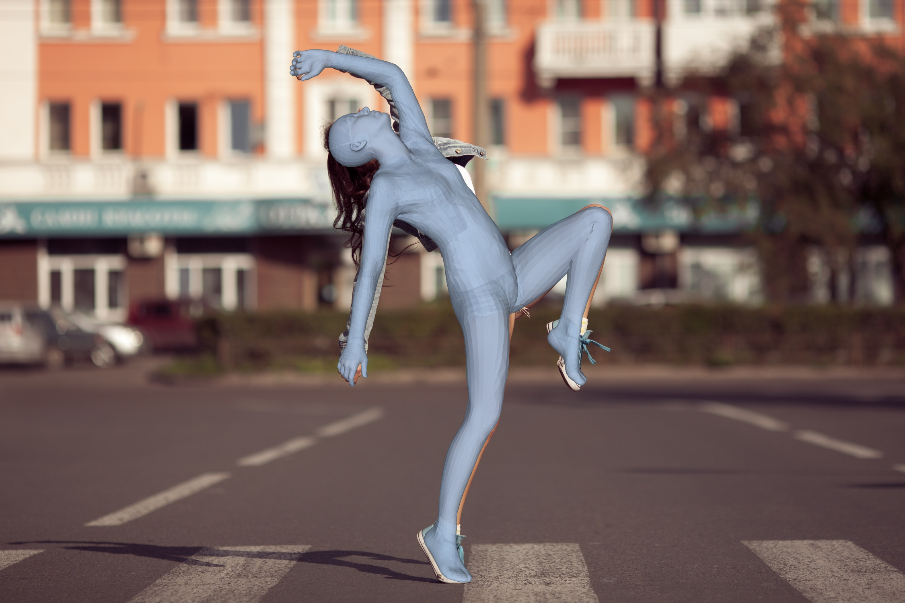
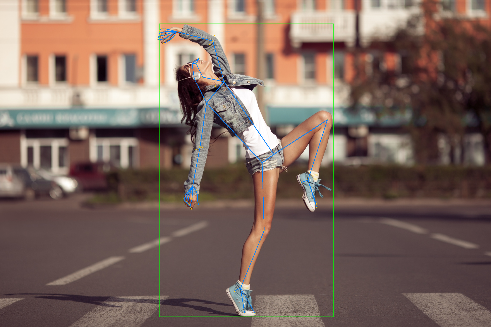
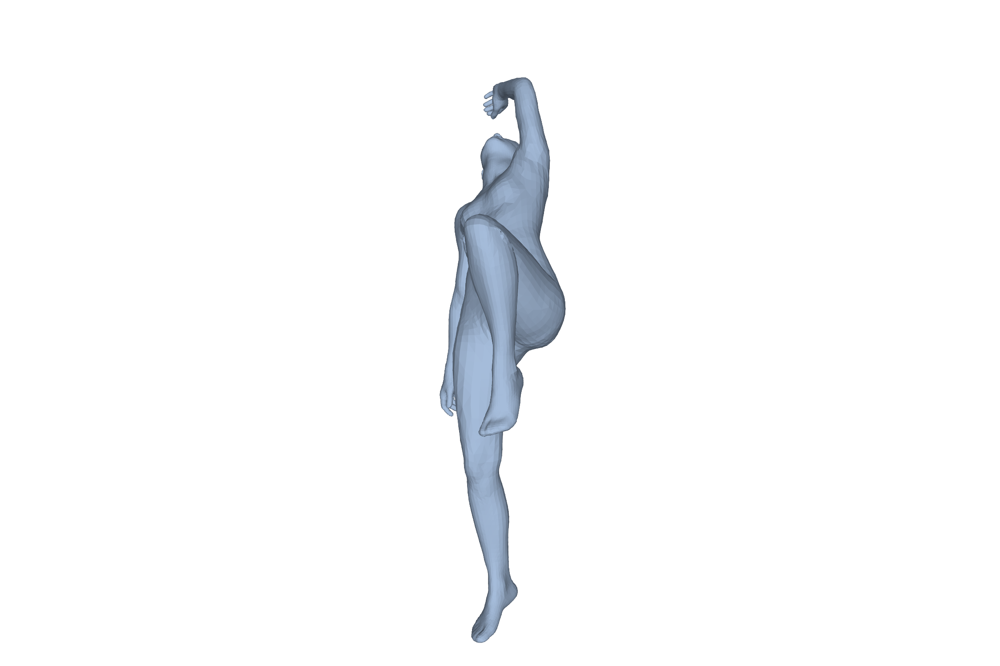

# SAM 3D Body

Single-image full-body 3D human mesh recovery.

## Input


(Image from the [official repository](https://github.com/facebookresearch/sam-3d-body).)

## Output

`output.png` : the recovered mesh (18439 vertices, Momentum Human Rig topology)
overlaid on the input.



`output_keypoints.png` : the bounding box and the projected mhr70 keypoints
(body, feet and both hands).



`output_side.png` : the same mesh seen from the side, on a white background.



`output_mesh_000.ply` : the mesh itself, one file per detected person.

## Usage

Automatically downloads the onnx and prototxt files on the first run.
It is necessary to be connected to the Internet while downloading.

For the sample image,
```bash
$ python3 sam_3d_body.py
```

If you want to specify the input image, put the image path after the `--input` option.
You can use `--savepath` option to change the name of the output file to save.
```bash
$ python3 sam_3d_body.py --input IMAGE_PATH --savepath SAVE_IMAGE_PATH
```

Two backbones are available. `vith` (ViT-H, 631M) is the default, `dinov3`
(DINOv3-H+, 840M) is slightly more accurate on EMDB/RICH.
```bash
$ python3 sam_3d_body.py -a dinov3
```

The recovered mesh is written as a PLY file next to the output image. To skip it:
```bash
$ python3 sam_3d_body.py --skip_ply
```

The camera intrinsics are estimated with MoGe. To skip it and fall back to the
default focal length (`sqrt(H^2 + W^2)`), which is faster but less accurate:
```bash
$ python3 sam_3d_body.py --no_fov
```

## Models

| Model | Role |
|---|---|
| `vitdet.onnx` | person detection (ViTDet, cascade Mask R-CNN) |
| `moge.onnx` | camera intrinsics estimation (MoGe-2 ViT-L) |
| `backbone_{vith,dinov3}.onnx` | image encoder for each person crop |
| `body_decoder_init_{vith,dinov3}.onnx` | promptable decoder + MHR mesh head |

`no_mask_embed_{vith,dinov3}.npy` (the mask-prompt constant added to the backbone
output, outside the decoder graph) and `mhr_faces.npy` (the MHR mesh triangles,
used only to draw the overlay) are small enough to ship with this sample.

`body_decoder_refine_*.onnx` and `hand_decoder_*.onnx` are also published. They
implement the extra passes of the original `inference_type="full"` pipeline
(dedicated hand decoding plus a keypoint-prompted second body pass); this sample
runs the single-pass `inference_type="body"` path, which already produces a
full-body mesh including hands.

## Reference

- [SAM 3D Body](https://github.com/facebookresearch/sam-3d-body)
- [Momentum Human Rig (MHR)](https://github.com/facebookresearch/MHR)

## Framework

Pytorch

## Model Format

ONNX opset=17

## Netron

- [vitdet.onnx.prototxt](https://netron.app/?url=https://storage.googleapis.com/ailia-models/sam-3d-body/vitdet.onnx.prototxt)
- [moge.onnx.prototxt](https://netron.app/?url=https://storage.googleapis.com/ailia-models/sam-3d-body/moge.onnx.prototxt)
- [backbone_vith.onnx.prototxt](https://netron.app/?url=https://storage.googleapis.com/ailia-models/sam-3d-body/backbone_vith.onnx.prototxt)
- [backbone_dinov3.onnx.prototxt](https://netron.app/?url=https://storage.googleapis.com/ailia-models/sam-3d-body/backbone_dinov3.onnx.prototxt)
- [body_decoder_init_vith.onnx.prototxt](https://netron.app/?url=https://storage.googleapis.com/ailia-models/sam-3d-body/body_decoder_init_vith.onnx.prototxt)
- [body_decoder_init_dinov3.onnx.prototxt](https://netron.app/?url=https://storage.googleapis.com/ailia-models/sam-3d-body/body_decoder_init_dinov3.onnx.prototxt)
- [body_decoder_refine_vith.onnx.prototxt](https://netron.app/?url=https://storage.googleapis.com/ailia-models/sam-3d-body/body_decoder_refine_vith.onnx.prototxt)
- [body_decoder_refine_dinov3.onnx.prototxt](https://netron.app/?url=https://storage.googleapis.com/ailia-models/sam-3d-body/body_decoder_refine_dinov3.onnx.prototxt)
- [hand_decoder_vith.onnx.prototxt](https://netron.app/?url=https://storage.googleapis.com/ailia-models/sam-3d-body/hand_decoder_vith.onnx.prototxt)
- [hand_decoder_dinov3.onnx.prototxt](https://netron.app/?url=https://storage.googleapis.com/ailia-models/sam-3d-body/hand_decoder_dinov3.onnx.prototxt)
