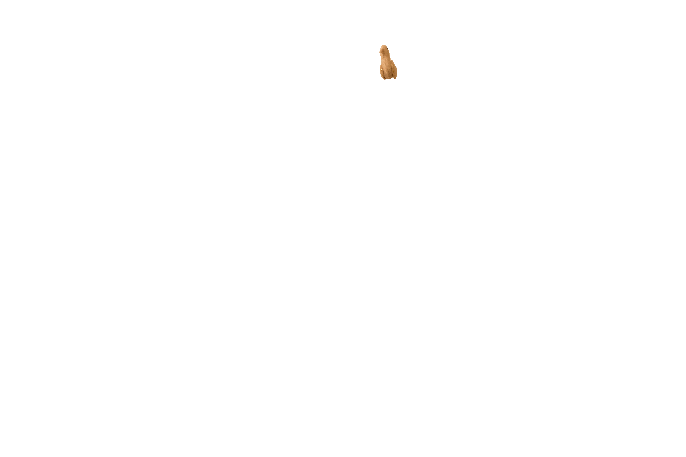
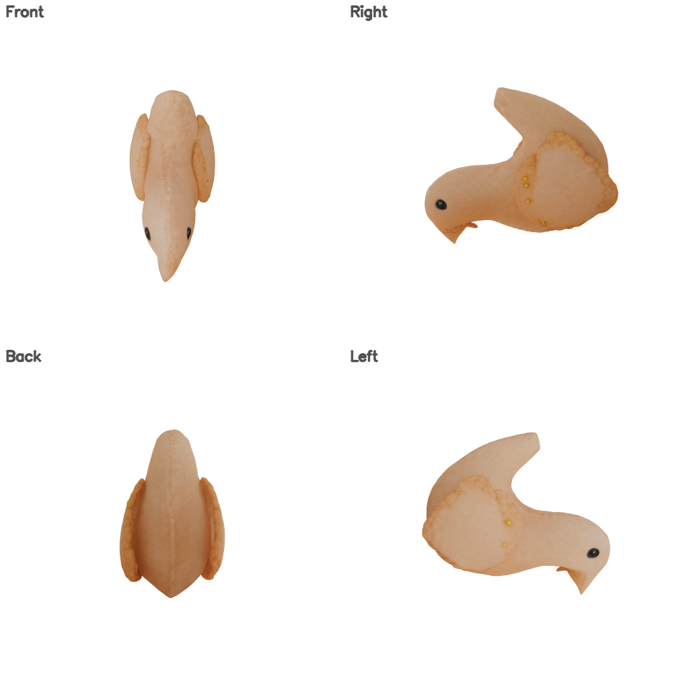

# SAM 3D Objects

Single image to 3D Gaussian Splatting reconstruction using SAM 3D Objects.

## Input


Mask image used to isolate the target object:



The mask file must be an **RGBA image where the alpha channel (A) encodes the object region**
(alpha > 0 = object, alpha = 0 = background).
A grayscale image is also accepted (white = object, black = background).

## Output

PLY file containing the 3D Gaussian Splatting representation of the object.

Preview image (4-view composite rendered from the PLY):



## Requirements

This model requires additional module.

```
pip3 install plyfile
```

## Usage

Automatically downloads the onnx and prototxt files on the first run.
It is necessary to be connected to the Internet while downloading.

For the sample image,
```bash
$ python3 sam_3d_objects.py
```

If you want to specify the input image and mask, use `--input` and `--mask`.
You can use `--savepath` to change the output file name.
The mask must be an RGBA image (object region in the alpha channel) or a grayscale image (white = object).
```bash
$ python3 sam_3d_objects.py --input IMAGE_PATH --mask MASK_PATH --savepath output.ply
```

To fix the random seed for reproducible results:
```bash
$ python3 sam_3d_objects.py --seed 42
```

To use PyTorch CUDA for initial noise generation instead of numpy:
```bash
$ python3 sam_3d_objects.py --torch-rng
```

## Reference

- [SAM 3D Objects](https://github.com/facebookresearch/sam-3d-objects)

## Framework

Pytorch

## Model Format

ONNX opset=17

## Netron

- [moge.onnx.prototxt](https://netron.app/?url=https://storage.googleapis.com/ailia-models/sam-3d-objects/moge.onnx.prototxt)
- [ss_condition_embedder.onnx.prototxt](https://netron.app/?url=https://storage.googleapis.com/ailia-models/sam-3d-objects/ss_condition_embedder.onnx.prototxt)
- [ss_generator_step.onnx.prototxt](https://netron.app/?url=https://storage.googleapis.com/ailia-models/sam-3d-objects/ss_generator_step.onnx.prototxt)
- [ss_decoder.onnx.prototxt](https://netron.app/?url=https://storage.googleapis.com/ailia-models/sam-3d-objects/ss_decoder.onnx.prototxt)
- [slat_condition_embedder.onnx.prototxt](https://netron.app/?url=https://storage.googleapis.com/ailia-models/sam-3d-objects/slat_condition_embedder.onnx.prototxt)
- [slat_generator_step.onnx.prototxt](https://netron.app/?url=https://storage.googleapis.com/ailia-models/sam-3d-objects/slat_generator_step.onnx.prototxt)
- [slat_decoder_gs.onnx.prototxt](https://netron.app/?url=https://storage.googleapis.com/ailia-models/sam-3d-objects/slat_decoder_gs.onnx.prototxt)
