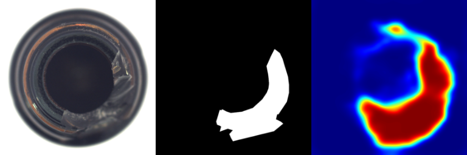

[ailia MODELS](../README.md) > Anomaly detection

# ailia MODELS : Anomaly detection

| | Model | Reference | Exported From | Supported Ailia Version | Date | Blog |
|:-----------|------------:|:------------:|:------------:|:------------:|:------------:|:------------:|
|  | [mahalanobisad](./mahalanobisad/) | [MahalanobisAD-pytorch](https://github.com/byungjae89/MahalanobisAD-pytorch/tree/master) | Pytorch | 1.2.9 and later | May 2020 | |
|  | [spade-pytorch](./spade-pytorch/) | [Sub-Image Anomaly Detection with Deep Pyramid Correspondences](https://github.com/byungjae89/SPADE-pytorch) | Pytorch | 1.2.6 and later | May 2020 | |
|  | [padim](./padim/) | [PaDiM-Anomaly-Detection-Localization-master](https://github.com/xiahaifeng1995/PaDiM-Anomaly-Detection-Localization-master) | Pytorch | 1.2.6 and later | Nov 2020 | [EN](https://tech.ailia.ai/en/padim-a-machine-learning-model-for-detecting-defective-products-without-retraining-5daa6f203377) [JP](https://tech.ailia.ai/padim-%E5%86%8D%E5%AD%A6%E7%BF%92%E4%B8%8D%E8%A6%81%E3%81%A7%E4%B8%8D%E8%89%AF%E5%93%81%E6%A4%9C%E7%9F%A5%E3%82%92%E8%A1%8C%E3%81%86%E6%A9%9F%E6%A2%B0%E5%AD%A6%E7%BF%92%E3%83%A2%E3%83%87%E3%83%AB-69add653fbd3) |
|  | [patchcore](./patchcore/) | [PatchCore_anomaly_detection](https://github.com/hcw-00/PatchCore_anomaly_detection) | Pytorch | 1.2.6 and later | Jun 2021 | |
|  | [glass](./glass/) | [A Unified Anomaly Synthesis Strategy with Gradient Ascent for Industrial Anomaly Detection and Localization](https://github.com/cqylunlun/GLASS) | Pytorch | 1.2.14 and later | Jul 2024 | |

[Back to the model list](../README.md)
