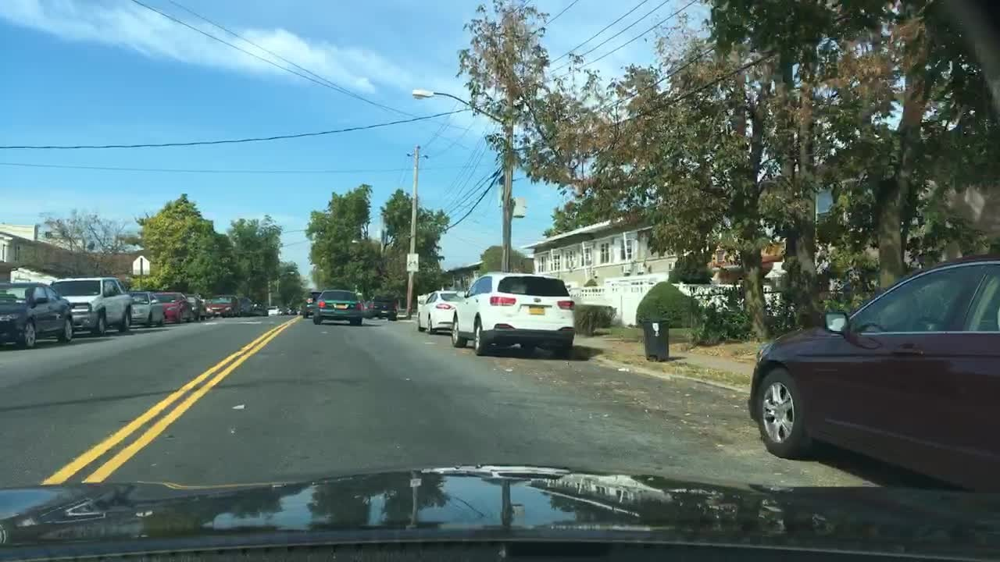
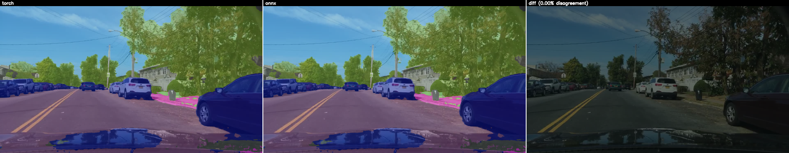

# SegFormer

## Input



(Driving scene image, 1280x720)

- Default model input: 1024x1024 RGB
- Range: normalized with ImageNet mean=[0.485, 0.456, 0.406], std=[0.229, 0.224, 0.225]

SegFormer is a simple, efficient, and powerful semantic segmentation model
that combines a hierarchical Transformer encoder (Mix Transformer / MiT)
with a lightweight all-MLP decode head.

## Output


The model outputs per-pixel class logits at 1/4 of the input resolution
(e.g. 256x256 for a 1024x1024 input). Logits are bilinearly upsampled to
the original image size before argmax.

The Cityscapes variants predict the 19 standard Cityscapes classes:
`road`, `sidewalk`, `building`, `wall`, `fence`, `pole`, `traffic light`,
`traffic sign`, `vegetation`, `terrain`, `sky`, `person`, `rider`, `car`,
`truck`, `bus`, `train`, `motorcycle`, `bicycle`.

The ADE20K variant predicts 150 scene-parsing classes.

## Usage

### Step 1: Export the ONNX model

The ONNX file is downloaded automatically on first run; if you want to
re-export it from the upstream HuggingFace checkpoint:

```bash
$ pip install torch torchvision transformers onnx onnxscript onnxruntime
$ cd export
$ python3 segformer_onnx_export.py --variant cityscapes-1024-1024 --verify
```

This downloads weights from `nvidia/segformer-b0-finetuned-cityscapes-1024-1024`,
exports `segformer_b0_cityscapes-1024-1024.onnx` to the parent directory and
verifies it with ONNX Runtime.

### Step 2: Run inference

With ailia SDK:
```bash
$ python3 segformer.py
```

With ONNX Runtime:
```bash
$ python3 segformer.py --onnx
```

You can specify the input image with `--input`:
```bash
$ python3 segformer.py --onnx --input IMAGE_PATH
```

You can use `--savepath` option to change the name of the output file:
```bash
$ python3 segformer.py --onnx --savepath SAVE_IMAGE_PATH
```

By adding the `--video` option, you can input a video.
If you pass `0` as VIDEO_PATH, the webcam is used.
```bash
$ python3 segformer.py --onnx --video VIDEO_PATH
```

### Choosing a model variant

The B0 model is published in five variants. Select one with `--arch`:

| Arch | Dataset | Input size | #classes |
|------|---------|------------|---------:|
| `cityscapes-1024-1024` (default) | Cityscapes | 1024x1024 | 19 |
| `cityscapes-768-768`             | Cityscapes |  768x768  | 19 |
| `cityscapes-640-1280`            | Cityscapes |  640x1280 | 19 |
| `cityscapes-512-1024`            | Cityscapes |  512x1024 | 19 |
| `ade-512-512`                    | ADE20K     |  512x512  | 150 |

```bash
$ python3 segformer.py --onnx --arch cityscapes-512-1024
```

You can also tune the segmentation overlay strength with `--alpha` (0..1,
default 0.5; 0 = original image only, 1 = mask only).

## ONNX Export Details

The wrapper exposes a single forward `pixel_values -> logits`, where
`pixel_values` is a normalized `(1, 3, H, W)` tensor and `logits` is
`(1, num_classes, H/4, W/4)`. The exporter uses ONNX opset 18 (default),
required for the dynamo-based `torch.onnx.export` path used by recent
PyTorch versions.

```bash
# Export each published B0 variant
$ cd export
$ python3 segformer_onnx_export.py --variant cityscapes-1024-1024 --verify
$ python3 segformer_onnx_export.py --variant cityscapes-768-768
$ python3 segformer_onnx_export.py --variant cityscapes-640-1280
$ python3 segformer_onnx_export.py --variant cityscapes-512-1024
$ python3 segformer_onnx_export.py --variant ade-512-512
```

### ONNX Runtime verification (cityscapes-1024-1024)

```
Model inputs:
  pixel_values: [1, 3, 1024, 1024]
Model outputs:
  logits: [1, 19, 256, 256]

logits max diff: 0.000012
PASSED (tolerance=0.001)
```

### End-to-end PyTorch vs ONNX comparison

`export/compare_torch_vs_onnx.py` runs both the upstream HuggingFace
PyTorch model and the exported ONNX through the same preprocessing on
`input.jpg` and renders a 3-panel comparison (`compare_<variant>.png`):
PyTorch overlay, ONNX overlay, and a per-pixel disagreement map.

For `cityscapes-1024-1024` on the bundled 1280x720 driving image:

```
max abs diff (logits):   6.10e-05
mean abs diff (logits):  4.11e-06
per-pixel argmax agreement: 100.0000%
```



## Architecture

SegFormer-B0 consists of:

1. **MiT-B0 encoder**: a hierarchical transformer producing features at
   strides 4, 8, 16, 32. Uses overlapping patch embeddings and
   efficient self-attention with sequence reduction (no positional
   encoding).
2. **All-MLP decode head**: each scale is projected to 256 channels with a
   linear layer, upsampled to 1/4 of the input, concatenated, then a final
   1x1 conv produces the per-class logits.

Parameters: ~3.7M (B0). Pretrained on ImageNet-1k, then fine-tuned on
Cityscapes or ADE20K by NVIDIA.

## File Structure

| File | Description |
|------|-------------|
| `segformer.py` | Main inference script (ONNX Runtime / ailia) |
| `export/segformer_onnx_export.py` | ONNX export script with verification |
| `export/compare_torch_vs_onnx.py` | PyTorch vs ONNX numerical / visual comparison |

## Reference

- [SegFormer (official repository)](https://github.com/NVlabs/SegFormer)
- [SegFormer: Simple and Efficient Design for Semantic Segmentation with Transformers (NeurIPS 2021)](https://arxiv.org/abs/2105.15203)
- HuggingFace checkpoints:
  - [nvidia/segformer-b0-finetuned-cityscapes-1024-1024](https://huggingface.co/nvidia/segformer-b0-finetuned-cityscapes-1024-1024)
  - [nvidia/segformer-b0-finetuned-cityscapes-768-768](https://huggingface.co/nvidia/segformer-b0-finetuned-cityscapes-768-768)
  - [nvidia/segformer-b0-finetuned-cityscapes-640-1280](https://huggingface.co/nvidia/segformer-b0-finetuned-cityscapes-640-1280)
  - [nvidia/segformer-b0-finetuned-cityscapes-512-1024](https://huggingface.co/nvidia/segformer-b0-finetuned-cityscapes-512-1024)
  - [nvidia/segformer-b0-finetuned-ade-512-512](https://huggingface.co/nvidia/segformer-b0-finetuned-ade-512-512)

## Framework

Pytorch (via HuggingFace Transformers)

## Model Format

ONNX opset=18

## Netron

[segformer_b0_cityscapes-1024-1024.onnx.prototxt](https://netron.app/?url=https://storage.googleapis.com/ailia-models/segformer/segformer_b0_cityscapes-1024-1024.onnx.prototxt)
