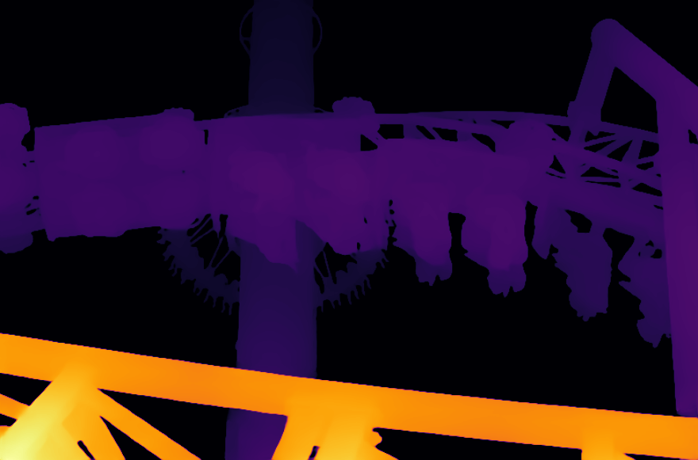
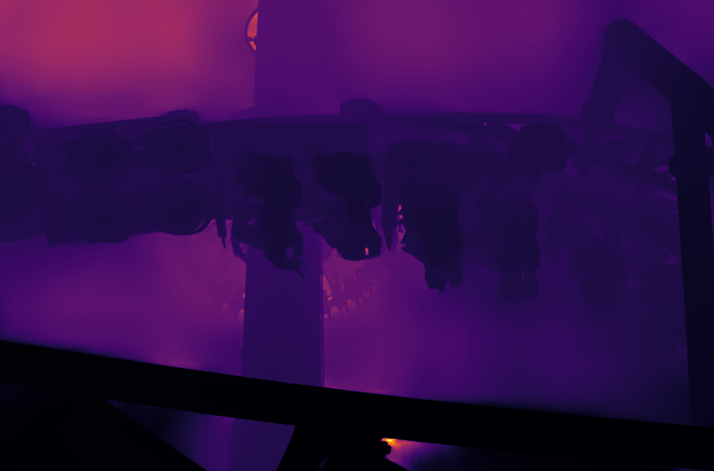
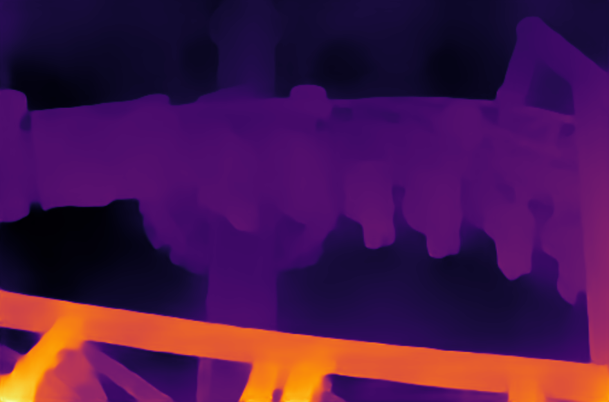

[ailia MODELS](../README.md) > Depth estimation

# ailia MODELS : Depth estimation

| | Model | Reference | Exported From | Supported Ailia Version | Date | Blog |
|:-----------|------------:|:------------:|:------------:|:------------:|:------------:|:------------:|
|  |[fcrn-depthprediction](./fcrn-depthprediction)| [Deeper Depth Prediction with Fully Convolutional Residual Networks](https://github.com/iro-cp/FCRN-DepthPrediction) | TensorFlow | 1.2.6 and later | Jun 2016 | |
|  | [monodepth2](./monodepth2)| [Monocular depth estimation from a single image](https://github.com/nianticlabs/monodepth2) | Pytorch | 1.2.2 and later | Jun 2018 | |
|  |[fast-depth](./fast-depth)| [ICRA 2019 "FastDepth: Fast Monocular Depth Estimation on Embedded Systems"](https://github.com/dwofk/fast-depth) | Pytorch | 1.2.5 and later | Mar 2019 | |
|  |[midas](./midas)| [Towards Robust Monocular Depth Estimation:  Mixing Datasets for Zero-shot Cross-dataset Transfer](https://github.com/intel-isl/MiDaS) | Pytorch | 1.2.4 and later | Jul 2019 | [EN](https://tech.ailia.ai/en/midas-a-machine-learning-model-for-depth-estimation-e96119cc1a3c) [JP](https://tech.ailia.ai/midas-%E5%A5%A5%E8%A1%8C%E3%81%8D%E3%82%92%E6%8E%A8%E5%AE%9A%E3%81%99%E3%82%8B%E6%A9%9F%E6%A2%B0%E5%AD%A6%E7%BF%92%E3%83%A2%E3%83%87%E3%83%AB-71e65a041e0f) |
|  |[hitnet](./hitnet)| [ONNX-HITNET-Stereo-Depth-estimation](https://github.com/ibaiGorordo/ONNX-HITNET-Stereo-Depth-estimation) | Pytorch | 1.2.9 and later | Jul 2020 | |
|  |[lap-depth](./lap-depth)| [LapDepth-release](https://github.com/tjqansthd/LapDepth-release) | Pytorch | 1.2.9 and later | Jan 2021 | |
|  |[mobilestereonet](./mobilestereonet)| [MobileStereoNet](https://github.com/cogsys-tuebingen/mobilestereonet) | Pytorch | 1.2.13 and later | Aug 2021 | |
|  |[crestereo](./crestereo)| [ONNX-CREStereo-Depth-Estimation](https://github.com/ibaiGorordo/ONNX-CREStereo-Depth-Estimation) | Pytorch | 1.2.13 and later | Mar 2022 | |
|  |[zoe_depth](./zoe_depth)| [ZoeDepth](https://github.com/isl-org/ZoeDepth) | Pytorch | 1.3.0 and later | Feb 2023 | |
|  |[depth_anything](./depth_anything)| [DepthAnything](https://github.com/LiheYoung/Depth-Anything) | Pytorch | 1.2.9 and later | Jan 2024 | |
|  |[depth_anything_v2](./depth_anything_v2)| [Depth Anything V2](https://github.com/DepthAnything/Depth-Anything-V2) | Pytorch | 1.2.16 and later | Jun 2024 | |
|  |[depth_pro](./depth_pro)| [Depth Pro: Sharp Monocular Metric Depth in Less Than a Second](https://github.com/apple/ml-depth-pro) | Pytorch | 1.2.12 and later | Oct 2024 | |
|  |[depth_anything_v3](./depth_anything_v3)| [Depth Anything V3](https://github.com/ByteDance-Seed/Depth-Anything-3) | Pytorch | 1.2.16 and later | Nov 2025 | |

[Back to the model list](../README.md)
