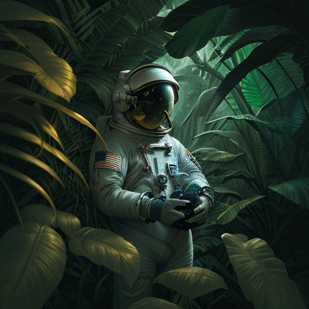
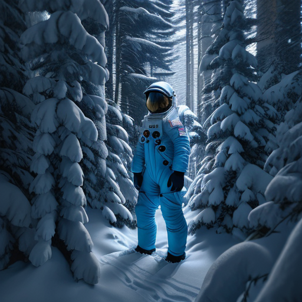

# DreamShaper (Stable Diffusion 1.5)

DreamShaper is a full fine-tune of Stable Diffusion 1.5, so the architecture
(UNet, KL-f8 VAE, CLIP ViT-L/14 text encoder) is identical to Stable Diffusion
1.5 and the native resolution is 512x512.

## Text-to-image

### Input

Prompt:
```
Astronaut in a jungle, cold color palette, muted colors, detailed, 8k
```

### Output



## Image-to-image

### Input

Image:


Prompt:
```
Astronaut standing in a snowy pine forest, heavy snowfall, cold blue color palette, detailed, 8k
```

### Output



## Requirements
This model requires additional module.

```
pip3 install transformers
```

## Usage
Automatically downloads the onnx and prototxt files on the first run.
It is necessary to be connected to the Internet while downloading.

For the sample image, (Text-to-image)
```bash
$ python3 dreamshaper-sd15.py
```

If you want to specify the input prompt, put the prompt after the `--input` option.  
You can use `--savepath` option to change the name of the output file to save.
```bash
$ python3 dreamshaper-sd15.py --input PROMPT --savepath SAVE_IMAGE_PATH
```

The default sampler is DPM++ 2M Karras (`--scheduler dpm++`), which is the
sampler DreamShaper is tuned for and produces high quality results in few
steps. When `--steps` is not given it defaults to 30 for `dpm++`. 512x512, and
the classifier free guidance scale defaults to 7.5.
```bash
$ python3 dreamshaper-sd15.py --scheduler dpm++ --steps 30 --guidance_scale 7.5 --width 512 --height 512 --seed 0
```

The model ships with a PNDM scheduler (`--scheduler pndm`). PNDM is a
lower-order sampler and needs more steps to converge (too few, e.g. 25, breaks
faces and fine detail), so with `pndm` the default number of steps is 50.
```bash
$ python3 dreamshaper-sd15.py --scheduler pndm --steps 50
```

`--width` and `--height` have to be multiples of 64. The model was trained at
512x512, so going much above that tends to duplicate the subject.

Use `--negative_prompt` to describe what the image should not contain. Without
it the unconditional branch is the encoding of an empty prompt.
```bash
$ python3 dreamshaper-sd15.py --negative_prompt "blurry, low quality"
```

### Image-to-image

Pass an input image with `--init_image` to run img2img. The output resolution
follows the input image (each side truncated to a multiple of 64), so
`--width` / `--height` are not used in this mode.
```bash
$ python3 dreamshaper-sd15.py --init_image IMAGE_PATH --input PROMPT
```

`--strength` (default 0.75) controls how much of the input image is kept:
smaller values stay closer to the input, `1.0` keeps nothing of it. It also
prunes the schedule, so only `steps * strength` steps are actually run.
```bash
$ python3 dreamshaper-sd15.py --init_image IMAGE_PATH --input PROMPT --strength 0.8
```

For img2img the prompt describes the **whole target image**, not the edit, so
start from a prompt that describes the input image and swap in only the part
you want changed.

## Reference

- [Hugging Face - Lykon/DreamShaper](https://huggingface.co/Lykon/DreamShaper)

## Framework

Pytorch

## Model Format

ONNX opset=17

## Netron

[dreamshaper_v8_unet.onnx.prototxt](https://netron.app/?url=https://storage.googleapis.com/ailia-models/dreamshaper-sd15/dreamshaper_v8_unet.onnx.prototxt)  
[dreamshaper_v8_text_encoder.onnx.prototxt](https://netron.app/?url=https://storage.googleapis.com/ailia-models/dreamshaper-sd15/dreamshaper_v8_text_encoder.onnx.prototxt)  
[dreamshaper_v8_vae_encoder.onnx.prototxt](https://netron.app/?url=https://storage.googleapis.com/ailia-models/dreamshaper-sd15/dreamshaper_v8_vae_encoder.onnx.prototxt)  
[dreamshaper_v8_vae_decoder.onnx.prototxt](https://netron.app/?url=https://storage.googleapis.com/ailia-models/dreamshaper-sd15/dreamshaper_v8_vae_decoder.onnx.prototxt)  
