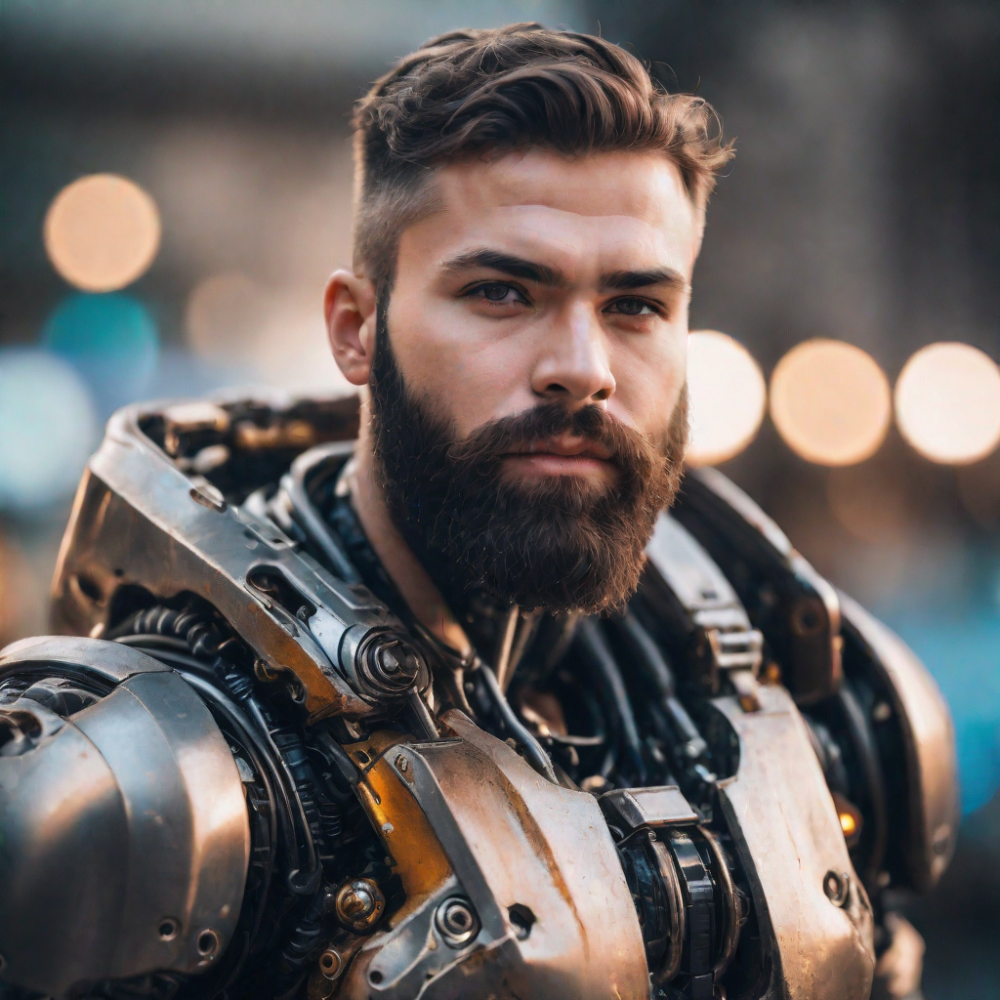
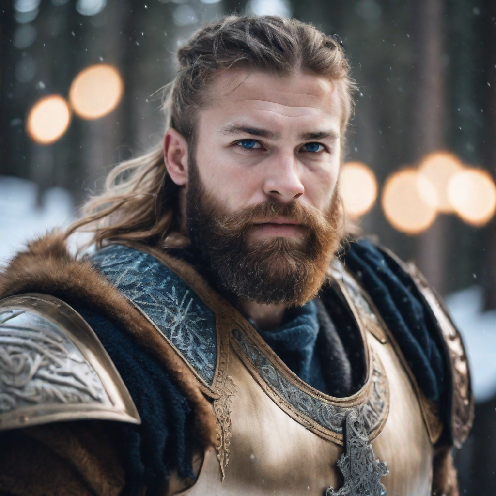

# DreamShaper XL 1.0

DreamShaper XL 1.0 is a full fine-tune of Stable Diffusion XL base 1.0, so the
architecture (UNet, KL-f8 VAE, CLIP ViT-L + OpenCLIP ViT-bigG dual text
encoders) is identical to SDXL base 1.0.

## Text-to-image

### Input

Prompt:
```
portrait photo of muscular bearded guy in a worn mech suit, light bokeh, intricate, steel metal, elegant, sharp focus, soft lighting, vibrant colors
```

### Output



## Image-to-image

### Input

Image:


Prompt:
```
portrait photo of a bearded viking warrior in ornate golden armor, heavy snowfall, snowy pine forest, cold blue light, intricate, elegant, sharp focus, vibrant colors
```

### Output



## Requirements
This model requires additional module.

```
pip3 install transformers
```

## Usage
Automatically downloads the onnx and prototxt files on the first run.
It is necessary to be connected to the Internet while downloading.

For the sample image, (Text-to-image)
```bash
$ python3 dreamshaper-xl.py
```

If you want to specify the input prompt, put the prompt after the `--input` option.  
You can use `--savepath` option to change the name of the output file to save.
```bash
$ python3 dreamshaper-xl.py --input PROMPT --savepath SAVE_IMAGE_PATH
```

The defaults follow the recipe recommended by the model card: DEIS multistep
scheduler, 25 steps, 1024x1024. The classifier free guidance scale defaults to
7.0.
```bash
$ python3 dreamshaper-xl.py --steps 25 --guidance_scale 7.0 --width 1024 --height 1024 --seed 0
```

`--width` and `--height` have to be multiples of 64.

Use `--negative_prompt` to describe what the image should not contain. Without
it the unconditional embedding is zeroed, which is what the model was trained
with.
```bash
$ python3 dreamshaper-xl.py --negative_prompt "blurry, low quality"
```

### Image-to-image

Pass an input image with `--init_image` to run img2img. The output resolution
follows the input image (each side truncated to a multiple of 64), so
`--width` / `--height` are not used in this mode.
```bash
$ python3 dreamshaper-xl.py --init_image IMAGE_PATH --input PROMPT
```

`--strength` (default 0.75) controls how much of the input image is kept:
smaller values stay closer to the input, `1.0` keeps nothing of it. It also
prunes the schedule, so only `steps * strength` steps are actually run. The
sample above was generated with `--strength 0.8`; below roughly 0.6 the input
dominates and a change of scene barely comes through.
```bash
$ python3 dreamshaper-xl.py --init_image IMAGE_PATH --input PROMPT --strength 0.8
```

For img2img the prompt describes the **whole target image**, not the edit, so
start from a prompt that describes the input image and swap in only the part
you want changed.

## Reference

- [Hugging Face - Lykon/dreamshaper-xl-1-0](https://huggingface.co/Lykon/dreamshaper-xl-1-0)

## Framework

Pytorch

## Model Format

ONNX opset=17

## Netron

[unet.onnx.prototxt](https://netron.app/?url=https://storage.googleapis.com/ailia-models/dreamshaper-xl/unet.onnx.prototxt)  
[text_encoder.onnx.prototxt](https://netron.app/?url=https://storage.googleapis.com/ailia-models/dreamshaper-xl/text_encoder.onnx.prototxt)  
[text_encoder_2.onnx.prototxt](https://netron.app/?url=https://storage.googleapis.com/ailia-models/dreamshaper-xl/text_encoder_2.onnx.prototxt)  
[vae_encoder.onnx.prototxt](https://netron.app/?url=https://storage.googleapis.com/ailia-models/dreamshaper-xl/vae_encoder.onnx.prototxt)  
[vae_decoder.onnx.prototxt](https://netron.app/?url=https://storage.googleapis.com/ailia-models/dreamshaper-xl/vae_decoder.onnx.prototxt)  
