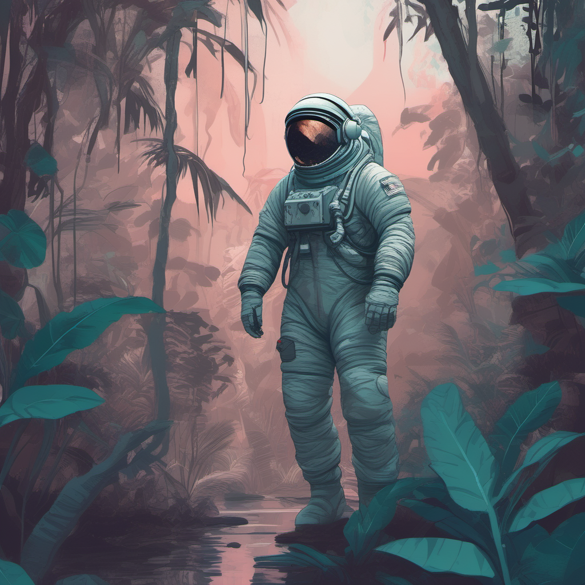

# Stable Diffusion XL

## Text-to-image

### Input

Prompt:
```
Astronaut in a jungle, cold color palette, muted colors, detailed, 8k
```

### Output



## Requirements
This model requires additional module.

```
pip3 install transformers
```

## Usage
Automatically downloads the onnx and prototxt files on the first run.
It is necessary to be connected to the Internet while downloading.

For the sample image, (Text-to-image)
```bash
$ python3 sdxl.py
```

If you want to specify the input prompt, put the prompt after the `--input` option.  
You can use `--savepath` option to change the name of the output file to save.
```bash
$ python3 sdxl.py --input PROMPT --savepath SAVE_IMAGE_PATH
```

You can control generation with the following options (defaults follow the
`generative-models` Streamlit demo: 50 steps, CFG scale 5.0, 1024x1024,
EulerEDMSampler / LegacyDDPMDiscretization / VanillaCFG).
```bash
$ python3 sdxl.py --steps 50 --guidance_scale 5.0 --width 1024 --height 1024 --seed 42
```

### Image-to-image

Pass an input image with `--input_image` to run img2img. The output resolution
follows the input image (each side truncated to a multiple of 64), so
`--width` / `--height` are not used in this mode.
```bash
$ python3 sdxl.py --input_image IMAGE_PATH --input PROMPT
```

`--strength` (default 0.75) controls how much of the input image is kept:
smaller values stay closer to the input, `1.0` keeps nothing of it.
```bash
$ python3 sdxl.py --input_image IMAGE_PATH --input PROMPT --strength 0.75
```

### Refiner

Add the `--refiner` option to run the SDXL refiner as a second stage
(ensemble of experts): the base model denoises down to the handoff sigma and
the refiner finishes the remaining low-noise steps on the same latent.
```bash
$ python3 sdxl.py --refiner
```

The refiner only adds its own UNet; its OpenCLIP bigG text encoder and VAE
decoder are byte-identical to the base ones, so the sample reuses the base
models for those and no separate weights are downloaded.

`--refiner_strength` (default 0.15) sets the fraction of the schedule handled
by the refiner, and `--negative_prompt` is used only in the refiner stage
(the base stage always zeroes the unconditional text embedding).
```bash
$ python3 sdxl.py --refiner --refiner_strength 0.15 --negative_prompt "blurry, low quality"
```

## Writing prompts

SDXL responds better to short natural phrases joined by commas than to a bare
list of tags. A prompt that fills in the following slots tends to work well:

```
[subject] + [appearance details] + [pose / action] + [background] +
[lighting / color] + [style / medium] + [quality words]
```

```
A lone astronaut in a bright red spacesuit, walking through a misty tropical
jungle, shallow river at his feet, soft pink sunset light, teal foliage,
digital painting, highly detailed, 8k
```

Both text encoders are limited to 77 CLIP tokens, so anything past roughly 75
words is truncated. Prompt weighting syntax such as `(word:1.2)` is not
implemented; the parentheses and numbers are tokenized literally. Put the words
that matter most near the front instead.

For img2img the prompt describes the **whole target image**, not the edit. A
bare instruction like `make the suit red` names only the change and drops every
other attribute of the input (the astronaut, the jungle, the lighting), so
classifier free guidance pulls the result away from the original composition.
Start from the prompt that describes the input image and swap in only the part
you want changed — here the same jungle-astronaut prompt with `red spacesuit`
added:

```bash
$ python3 sdxl.py --input_image image.png --strength 0.85 --guidance_scale 8.0 \
    --input "Astronaut in a red spacesuit standing in a jungle, cold color palette, muted colors, detailed, 8k"
```

`--strength` prunes the sigma schedule rather than scaling the noise level
directly, so its effect is far from linear. Measured values at the default
`--steps 50` (the full schedule starts at sigma 14.615):

| `--strength` | Steps run (of 50) | Starting sigma |
|---|---|---|
| 0.3 | 14 | 0.773 |
| 0.45 | 21 | 1.239 |
| 0.6 | 29 | 2.120 |
| 0.75 (default) | 37 | 3.913 |
| 0.9 | 44 | 7.485 |
| 1.0 | 50 | 14.615 |

Even the default 0.75 starts at less than a third of the full noise level, so
the layout and palette of the input largely survive. To repaint an object or
change a dominant color, go to 0.85 or above; values below 0.5 only adjust
texture and fine detail.

## Reference

- [Hugging Face - stabilityai/stable-diffusion-xl-base-1.0](https://huggingface.co/stabilityai/stable-diffusion-xl-base-1.0)
- [Stability-AI/generative-models](https://github.com/Stability-AI/generative-models)

## Framework

Pytorch

## Model Format

ONNX opset=17

## Netron

[sdxl_unet.onnx.prototxt](https://netron.app/?url=https://storage.googleapis.com/ailia-models/sdxl/sdxl_unet.onnx.prototxt)  
[sdxl_text_encoder_clip_l.onnx.prototxt](https://netron.app/?url=https://storage.googleapis.com/ailia-models/sdxl/sdxl_text_encoder_clip_l.onnx.prototxt)  
[sdxl_text_encoder_open_clip_bigg.onnx.prototxt](https://netron.app/?url=https://storage.googleapis.com/ailia-models/sdxl/sdxl_text_encoder_open_clip_bigg.onnx.prototxt)  
[sdxl_vae_decoder.onnx.prototxt](https://netron.app/?url=https://storage.googleapis.com/ailia-models/sdxl/sdxl_vae_decoder.onnx.prototxt)  
[sdxl_vae_encoder.onnx.prototxt](https://netron.app/?url=https://storage.googleapis.com/ailia-models/sdxl/sdxl_vae_encoder.onnx.prototxt)  
[sdxl_refiner_unet.onnx.prototxt](https://netron.app/?url=https://storage.googleapis.com/ailia-models/sdxl/sdxl_refiner_unet.onnx.prototxt)
