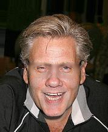

[ailia MODELS](../README.md) > Generative adversarial networks

# ailia MODELS : Generative adversarial networks

| | Model | Reference | Exported From | Supported Ailia Version | Date | Blog |
|:-----------|------------:|:------------:|:------------:|:------------:|:------------:|:------------:|
|  |[pytorch-gan](./pytorch-gan) | [Code repo for the Pytorch GAN Zoo project (used to train this model)](https://github.com/facebookresearch/pytorch_GAN_zoo)| Pytorch | 1.2.4 and later | Oct 2017 | |
|  | [lipgan](./lipgan/) | [LipGAN](https://github.com/Rudrabha/LipGAN) | Keras | 1.2.15 and later | Oct 2019 | [JP](https://tech.ailia.ai/lipgan-%E3%83%AA%E3%83%83%E3%83%97%E3%82%B7%E3%83%B3%E3%82%AF%E5%8B%95%E7%94%BB%E3%82%92%E7%94%9F%E6%88%90%E3%81%99%E3%82%8B%E6%A9%9F%E6%A2%B0%E5%AD%A6%E7%BF%92%E3%83%A2%E3%83%87%E3%83%AB-57511508eaff) |
|  | [council-gan](./council-gan)| [Council-GAN](https://github.com/Onr/Council-GAN)| Pytorch | 1.2.4 and later | Nov 2019 | |
|  | [ax_glasses_removal](./ax_glasses_removal/) | [AX Glasses Removal](https://storage.googleapis.com/ailia-models/ax_glasses_removal/ax_glasses_removal_mobile.onnx) | Pytorch | 1.5.0 and later | Aug 2026 | |
|  | [sam](./sam)| [Age Transformation Using a Style-Based Regression Model](https://github.com/yuval-alaluf/SAM)| Pytorch | 1.2.9 and later | Feb 2021 | |
|  | [encoder4editing](./encoder4editing/) | [Designing an Encoder for StyleGAN Image Manipulation](https://github.com/omertov/encoder4editing) | Pytorch | 1.2.10 and later | Feb 2021 | |
|  | [restyle-encoder](./restyle-encoder)| [ReStyle](https://github.com/yuval-alaluf/restyle-encoder)| Pytorch | 1.2.9 and later | Apr 2021 | |
|  | [SadTalker](./sadtalker/) | [SadTalker](https://github.com/OpenTalker/SadTalker) | Pytorch | 1.5.0 and later | Nov 2022 |  |
|  | [live_portrait](./live_portrait)| [LivePortrait](https://github.com/KwaiVGI/LivePortrait) | Pytorch | 1.5.0 and later | Jul 2024 | [EN](https://tech.ailia.ai/en/live-portrait-bring-portraits-to-life-1aa682082d80/) [JP](https://tech.ailia.ai/live-portrait-1%E6%9E%9A%E3%81%AE%E7%94%BB%E5%83%8F%E3%82%92%E5%8B%95%E3%81%8B%E3%81%9B%E3%82%8Bai%E3%83%A2%E3%83%87%E3%83%AB-8eaa7d3eb683)|

[Back to the model list](../README.md)
