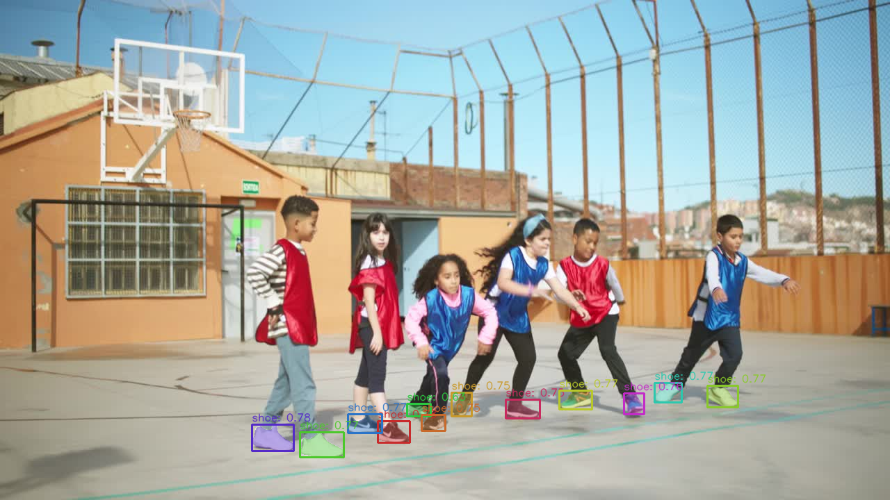

[ailia MODELS](../README.md) > Image segmentation

# ailia MODELS : Image segmentation

[Accuracy metrics](./METRICS.md)

| | Model | Reference | Exported From | Supported Ailia Version | Date | Blog |
|:-----------|------------:|:------------:|:------------:|:------------:|:------------:|:------------:|
|  | [pytorch-fcn](./pytorch-fcn/) | [pytorch-fcn](https://github.com/wkentaro/pytorch-fcn) | Pytorch | 1.3.0 and later | Nov 2014 | |
|  | [pytorch-enet](./pytorch-enet/) | [PyTorch-ENet](https://github.com/davidtvs/PyTorch-ENet) | Pytorch | 1.2.8 and later | Jun 2016 | |
|  | [tusimple-DUC](./tusimple-DUC/) | [TuSimple-DUC](https://github.com/TuSimple/TuSimple-DUC) | Pytorch | 1.2.10 and later | Feb 2017 |  |
|  | [pytorch-unet](./pytorch-unet/) | [Pytorch-Unet](https://github.com/milesial/Pytorch-UNet) | Pytorch | 1.2.5 and later | Aug 2017 | |
|  | [deeplabv3](./deeplabv3/) | [Xception65 for backbone network of DeepLab v3+](https://github.com/tensorflow/models/tree/master/research/deeplab) | Chainer | 1.2.0 and later | Feb 2018 | |
|  | [pspnet-hair-segmentation](./pspnet-hair-segmentation/) | [pytorch-hair-segmentation](https://github.com/YBIGTA/pytorch-hair-segmentation) | Pytorch | 1.2.2 and later | Nov 2018 | |
|  | [swiftnet](./swiftnet/) | [SwiftNet](https://github.com/orsic/swiftnet) | Pytorch | 1.2.6 and later | Mar 2019 | |
|  | [hrnet_segmentation](./hrnet_segmentation/) | [High-resolution networks (HRNets) for Semantic Segmentation](https://github.com/HRNet/HRNet-Semantic-Segmentation) | Pytorch | 1.2.1 and later | Apr 2019 | |
|  | [hair_segmentation](./hair_segmentation/) | [hair segmentation in mobile device](https://github.com/thangtran480/hair-segmentation) | Keras | 1.2.1 and later | Jul 2019 | |
|  | [paddleseg](./paddleseg/) | [PaddleSeg](https://github.com/PaddlePaddle/PaddleSeg/tree/release/2.3/contrib/CityscapesSOTA) | Pytorch | 1.2.7 and later | Aug 2019 | [EN](https://tech.ailia.ai/en/paddleseg-highly-accurate-segmentation-model-using-hierarchical-attention-18e69363dc2a) [JP](https://tech.ailia.ai/paddleseg-%E9%9A%8E%E5%B1%A4%E7%9A%84%E3%81%AA%E3%82%A2%E3%83%86%E3%83%B3%E3%82%B7%E3%83%A7%E3%83%B3%E3%82%92%E4%BD%BF%E7%94%A8%E3%81%97%E3%81%9F%E9%AB%98%E7%B2%BE%E5%BA%A6%E3%81%AA%E3%82%BB%E3%82%B0%E3%83%A1%E3%83%B3%E3%83%86%E3%83%BC%E3%82%B7%E3%83%A7%E3%83%B3%E3%83%A2%E3%83%87%E3%83%AB-acc89bf50423) |
|  | [human_part_segmentation](./human_part_segmentation/) | [Self Correction for Human Parsing](https://github.com/PeikeLi/Self-Correction-Human-Parsing) | Pytorch | 1.2.4 and later | Oct 2019 | [EN](https://tech.ailia.ai/en/humanpartsegmentation-a-machine-learning-model-for-segmenting-human-parts-cd7e39480714) [JP](https://tech.ailia.ai/humanpartsegmentation-%E5%8B%95%E7%94%BB%E3%81%8B%E3%82%89%E4%BD%93%E3%81%AE%E9%83%A8%E4%BD%8D%E3%82%92%E3%82%BB%E3%82%B0%E3%83%A1%E3%83%B3%E3%83%86%E3%83%BC%E3%82%B7%E3%83%A7%E3%83%B3%E3%81%99%E3%82%8B%E6%A9%9F%E6%A2%B0%E5%AD%A6%E7%BF%92%E3%83%A2%E3%83%87%E3%83%AB-e8a0e405255) |
|  | [semantic-segmentation-mobilenet-v3](./semantic-segmentation-mobilenet-v3) | [Semantic segmentation with MobileNetV3](https://github.com/OniroAI/Semantic-segmentation-with-MobileNetV3) | TensorFlow | 1.2.5 and later | Nov 2019 | |
|  | [suim](./suim/) | [SUIM](https://github.com/IRVLab/SUIM) | Keras | 1.2.6 and later | Apr 2020 |  |
|  | [yet-another-anime-segmenter](./yet-another-anime-segmenter/) | [Yet Another Anime Segmenter](https://github.com/zymk9/Yet-Another-Anime-Segmenter) | Pytorch | 1.2.6 and later | Oct 2020 | |
|  | [dense_prediction_transformers](./dense_prediction_transformers/) | [Vision Transformers for Dense Prediction](https://github.com/intel-isl/DPT)   | Pytorch | 1.2.7 and later | Mar 2021 | [EN](https://tech.ailia.ai/en/dpt-segmentation-model-using-vision-transformer-b479f3027468) [JP](https://tech.ailia.ai/dpt-vision-transformer%E3%82%92%E4%BD%BF%E7%94%A8%E3%81%97%E3%81%9F%E3%82%BB%E3%82%B0%E3%83%A1%E3%83%B3%E3%83%86%E3%83%BC%E3%82%B7%E3%83%A7%E3%83%B3%E3%83%A2%E3%83%87%E3%83%AB-88db4842b4a7) |
|  | [group_vit](./group_vit/) | [GroupViT](https://github.com/NVlabs/GroupViT) | Pytorch | 1.2.10 and later | Feb 2022 |  |
|  | [pp_liteseg](./pp_liteseg/) | [PP-LiteSeg](https://github.com/PaddlePaddle/PaddleSeg/tree/develop/configs/pp_liteseg) | Pytorch | 1.2.10 and later | Apr 2022 |  |
|  | [anime-segmentation](./anime-segmentation/) | [Anime Segmentation](https://github.com/SkyTNT/anime-segmentation) | Pytorch | 1.2.9 and later | Aug 2022 | |
|  | [yolov8-seg](./yolov8-seg/) | [YOLOv8](https://github.com/ultralytics/ultralytics) | Pytorch | 1.2.14.1 and later | Jan 2023 |  |
|  | [segment-anything](./segment-anything/) | [Segment Anything](https://github.com/facebookresearch/segment-anything) | Pytorch | 1.2.16 and later | Apr 2023 | [EN](https://tech.ailia.ai/en/segmentanything-a-segmentation-model-with-target-specification-50514d9908e9/) [JP](https://tech.ailia.ai/segmentanything-%E3%82%BB%E3%82%B0%E3%83%A1%E3%83%B3%E3%83%86%E3%83%BC%E3%82%B7%E3%83%A7%E3%83%B3%E3%81%AE%E5%AF%BE%E8%B1%A1%E3%82%92%E5%BA%A7%E6%A8%99%E3%81%A7%E6%8C%87%E5%AE%9A%E3%81%A7%E3%81%8D%E3%82%8B%E3%82%BB%E3%82%B0%E3%83%A1%E3%83%B3%E3%83%86%E3%83%BC%E3%82%B7%E3%83%A7%E3%83%B3%E3%83%A2%E3%83%87%E3%83%AB-fa6c917c3e51/) |
|  | [grounded_sam](./grounded_sam/) | [Grounded-SAM](https://github.com/IDEA-Research/Grounded-Segment-Anything/tree/main) | Pytorch | 1.2.16 and later | Apr 2023 | [EN](https://tech.ailia.ai/en/grounded-sam-segmented-any-object-from-text-7727f0500a8a/) [JP](https://tech.ailia.ai/grounded-sam-%E4%BB%BB%E6%84%8F%E3%81%AE%E7%89%A9%E4%BD%93%E3%82%92%E3%82%BB%E3%82%B0%E3%83%A1%E3%83%B3%E3%83%86%E3%83%BC%E3%82%B7%E3%83%A7%E3%83%B3%E3%81%A7%E3%81%8D%E3%82%8B%E6%A9%9F%E6%A2%B0%E5%AD%A6%E7%BF%92%E3%83%A2%E3%83%87%E3%83%AB-4ed37911fef8/) |
|  | [fast_sam](./fast_sam/) | [FastSAM](https://github.com/CASIA-IVA-Lab/FastSAM) | Pytorch | 1.2.14 and later | Jun 2023 | |
|  | [mobile_sam](./mobile_sam/) | [MobileSAM](https://github.com/ChaoningZhang/MobileSAM) | Pytorch | 1.6.0 and later | Jun 2023 | |
|  | [edge_sam](./edge_sam/) | [EdgeSAM](https://github.com/chongzhou96/EdgeSAM) | Pytorch | 1.2.10 and later | Dec 2023 | |
|  | [segment-anything-2](./segment-anything-2/) | [Segment Anything 2](https://github.com/facebookresearch/segment-anything-2) | Pytorch | 1.2.16 and later | Jul 2024 | [EN](https://tech.ailia.ai/en/segmentanything2-segmentation-model-for-arbitrary-objects-in-videos-7565a325924c/) [JP](https://tech.ailia.ai/segmentanyhing2-%E5%8B%95%E7%94%BB%E3%81%AB%E5%AF%BE%E5%BF%9C%E3%81%97%E3%81%9F%E4%BB%BB%E6%84%8F%E7%89%A9%E4%BD%93%E3%81%AE%E3%82%BB%E3%82%B0%E3%83%A1%E3%83%B3%E3%83%86%E3%83%BC%E3%82%B7%E3%83%A7%E3%83%B3%E3%83%A2%E3%83%87%E3%83%AB-425ff2ae14a4/) |
|  | [yolov11-seg](./yolov11-seg/) | [Ultralytics YOLO11](https://github.com/ultralytics/ultralytics) | Pytorch | 1.2.14.1 and later | Sep 2024 |  |
|  | [segment-anything-3.1](./segment-anything-3.1/) | [Segment Anything 3](https://github.com/facebookresearch/sam3) | Pytorch | 1.6.0 and later | March 2026 |  |

[Back to the model list](../README.md)
