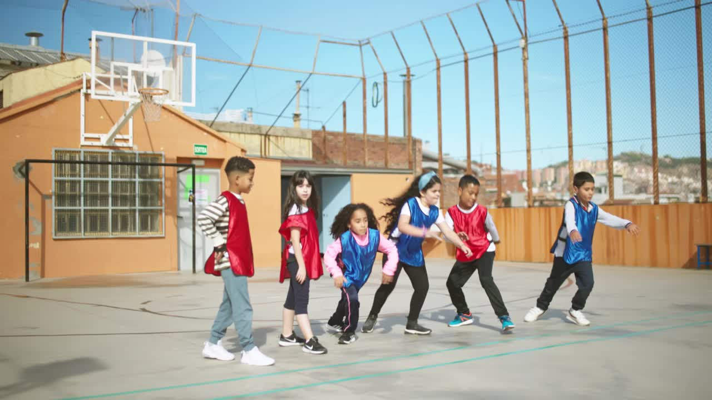
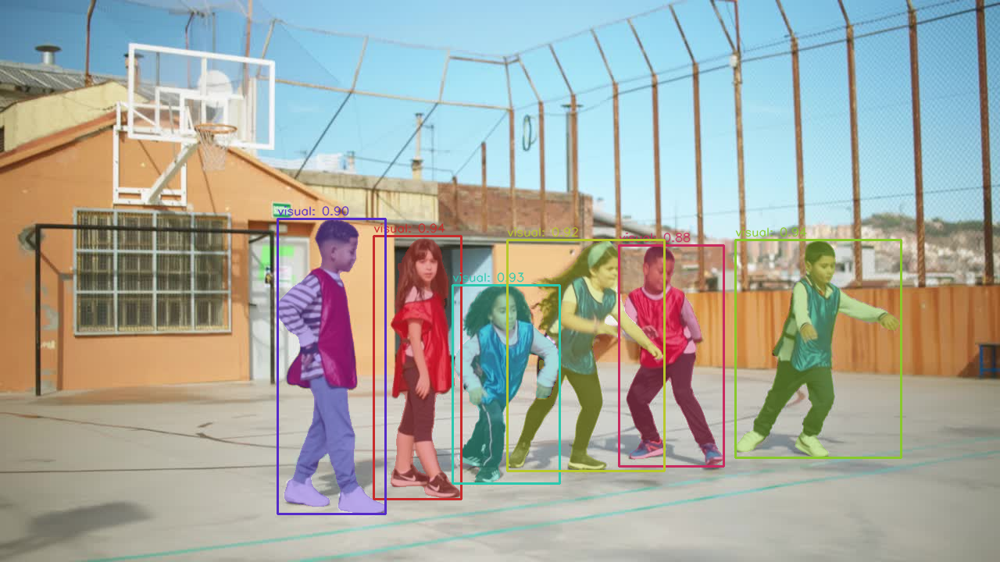
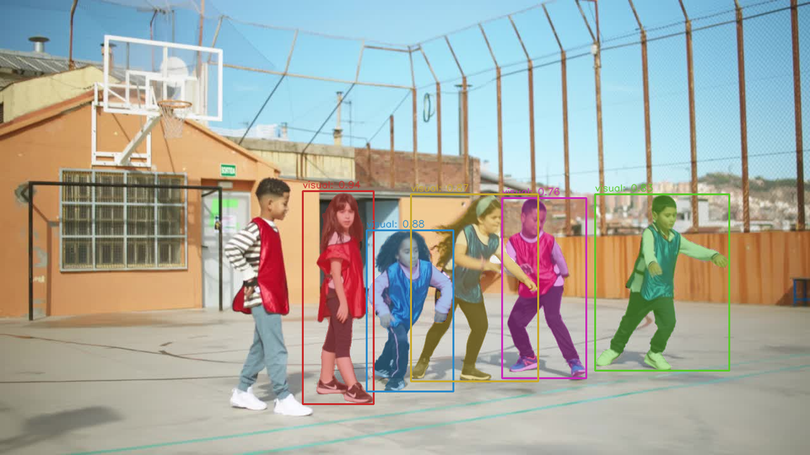

# SAM 3.1

## Image mode

### Input



### Output

#### Text prompt

```bash
$ python3 segment_anything_3_1.py --caption "shoe"
```


#### Single box (visual prompt)

```bash
$ python3 segment_anything_3_1.py --box 480 290 590 650
```



#### Multi-box (positive + negative)

```bash
$ python3 segment_anything_3_1.py --box 480 290 590 650 --box 370 280 485 655 --box_label 1 0
```



## Requirements

This model requires additional modules.

```bash
pip3 install ftfy regex
```

## Usage

Automatically downloads the onnx and prototxt files on the first run.
It is necessary to be connected to the Internet while downloading.

For the sample image,
```bash
$ python3 segment_anything_3_1.py
```

You can specify a text prompt with the `--caption` option.
```bash
$ python3 segment_anything_3_1.py --caption "shoe"
```

If you want to specify the input image, put the image path after the `--input` option.
You can use `--savepath` option to change the name of the output file to save.
```bash
$ python3 segment_anything_3_1.py --input IMAGE_PATH --savepath SAVE_IMAGE_PATH
```

You can adjust the confidence threshold with the `--threshold` option.
```bash
$ python3 segment_anything_3_1.py --threshold 0.5
```

If you want to specify a bounding box prompt, put the coordinates (x1, y1, x2, y2) after the `--box` option.
```bash
$ python3 segment_anything_3_1.py --box 100 200 400 500
```

You can specify labels per box (1=positive, 0=negative) with `--box_label`.
```bash
$ python3 segment_anything_3_1.py --box 100 200 400 500 --box_label 1
```

For video tracking mode, specify a video file or frame directory with the `--video` option and add `--tracking`.
```bash
$ wget https://github.com/facebookresearch/sam3/raw/refs/heads/main/assets/videos/bedroom.mp4
$ python3 segment_anything_3_1.py --video bedroom.mp4 --tracking --caption "person"
```

You can use a directory of image frames as input.
```bash
$ python3 segment_anything_3_1.py --video videos/0001 --tracking --caption "shoe"
```

For point-based prompts in video tracking mode, use the `--point` option.
```bash
$ python3 segment_anything_3_1.py --video videos/0001 --tracking --point 320 240
```

Multiple points can be specified.
```bash
$ python3 segment_anything_3_1.py --video videos/0001 --tracking --point 320 240 --point 400 300
```

Labels per point (1=positive, 0=negative) can be specified with `--point_label`.
```bash
$ python3 segment_anything_3_1.py --video videos/0001 --tracking --point 320 240 --point_label 1
```

## Reference

- [SAM 3: Segment Anything with Concepts](https://github.com/facebookresearch/sam3)

## Framework

PyTorch

## Model Format

ONNX opset=18

## Netron

- [sam3.1_image_encoder.onnx.prototxt](https://netron.app/?url=https://storage.googleapis.com/ailia-models/segment-anything-3.1/sam3.1_image_encoder.onnx.prototxt)
- [sam3.1_grounding.onnx.prototxt](https://netron.app/?url=https://storage.googleapis.com/ailia-models/segment-anything-3.1/sam3.1_grounding.onnx.prototxt)
- [sam3.1_prompt_encoder.onnx.prototxt](https://netron.app/?url=https://storage.googleapis.com/ailia-models/segment-anything-3.1/sam3.1_prompt_encoder.onnx.prototxt)
- [sam3.1_mask_decoder.onnx.prototxt](https://netron.app/?url=https://storage.googleapis.com/ailia-models/segment-anything-3.1/sam3.1_mask_decoder.onnx.prototxt)
- [sam3.1_tracking_mask_decoder.onnx.prototxt](https://netron.app/?url=https://storage.googleapis.com/ailia-models/segment-anything-3.1/sam3.1_tracking_mask_decoder.onnx.prototxt)
- [sam3.1_memory_encoder.onnx.prototxt](https://netron.app/?url=https://storage.googleapis.com/ailia-models/segment-anything-3.1/sam3.1_memory_encoder.onnx.prototxt)
- [sam3.1_memory_attention.onnx.prototxt](https://netron.app/?url=https://storage.googleapis.com/ailia-models/segment-anything-3.1/sam3.1_memory_attention.onnx.prototxt)
- [sam3.1_obj_ptr_proj.onnx.prototxt](https://netron.app/?url=https://storage.googleapis.com/ailia-models/segment-anything-3.1/sam3.1_obj_ptr_proj.onnx.prototxt)
- [sam3.1_interactive_obj_ptr_proj.onnx.prototxt](https://netron.app/?url=https://storage.googleapis.com/ailia-models/segment-anything-3.1/sam3.1_interactive_obj_ptr_proj.onnx.prototxt)
- [sam3.1_obj_ptr_tpos_proj.onnx.prototxt](https://netron.app/?url=https://storage.googleapis.com/ailia-models/segment-anything-3.1/sam3.1_obj_ptr_tpos_proj.onnx.prototxt)
