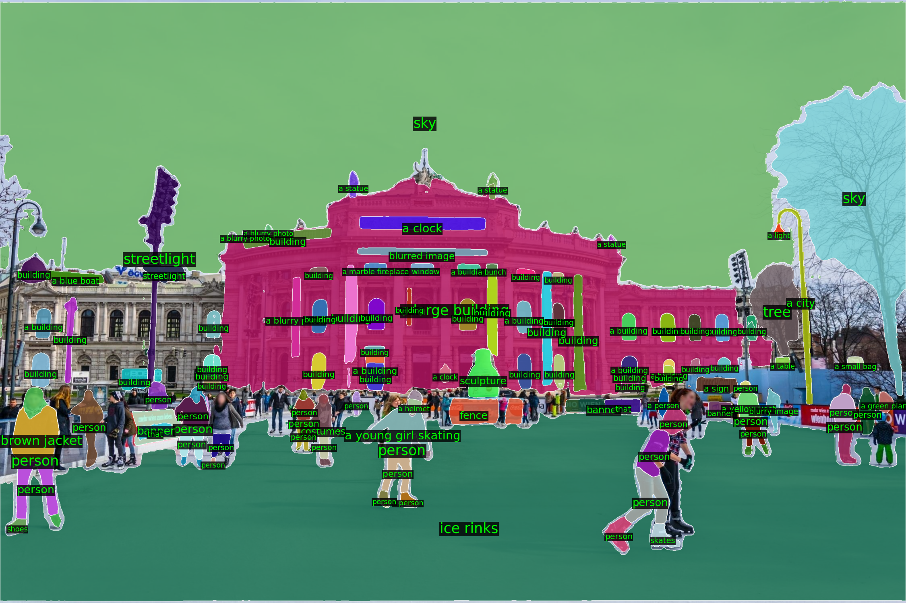

# Semantic Segment Anything

## Input


## Output



## Requirements

This model requires additional modules.

```bash
pip3 install spacy transformers
python3 -m spacy download en_core_web_sm
```

Tokenizer files must also be present in the working directory:

- `blip_tokenizer/` — BLIP BertTokenizerFast files
- `clip_tokenizer/` — CLIP CLIPTokenizerFast files

## Usage

Automatically downloads the onnx and prototxt files on the first run.
It is necessary to be connected to the Internet while downloading.

For the sample image,
```bash
$ python3 semantic_segment_anything.py
```

If you want to specify the input image, put the image path after the `--input` option.  
You can use `--savepath` option to change the name of the output file to save.
```bash
$ python3 semantic_segment_anything.py --input IMAGE_PATH --savepath SAVE_IMAGE_PATH
```

## Reference

- [Semantic Segment Anything](https://github.com/fudan-zvg/Semantic-Segment-Anything)

## Framework

Pytorch

## Model Format

ONNX opset=17

## Netron

[sam_image_encoder.onnx.prototxt](https://netron.app/?url=https://storage.googleapis.com/ailia-models/semantic-segment-anything/sam_image_encoder.onnx.prototxt)

[sam_mask_decoder.onnx.prototxt](https://netron.app/?url=https://storage.googleapis.com/ailia-models/semantic-segment-anything/sam_mask_decoder.onnx.prototxt)

[clip_vision_encoder.onnx.prototxt](https://netron.app/?url=https://storage.googleapis.com/ailia-models/semantic-segment-anything/clip_vision_encoder.onnx.prototxt)

[clip_text_encoder.onnx.prototxt](https://netron.app/?url=https://storage.googleapis.com/ailia-models/semantic-segment-anything/clip_text_encoder.onnx.prototxt)

[oneformer_ade20k.onnx.prototxt](https://netron.app/?url=https://storage.googleapis.com/ailia-models/semantic-segment-anything/oneformer_ade20k.onnx.prototxt)

[oneformer_coco.onnx.prototxt](https://netron.app/?url=https://storage.googleapis.com/ailia-models/semantic-segment-anything/oneformer_coco.onnx.prototxt)

[clipseg.onnx.prototxt](https://netron.app/?url=https://storage.googleapis.com/ailia-models/semantic-segment-anything/clipseg.onnx.prototxt)

[blip_vision_encoder.onnx.prototxt](https://netron.app/?url=https://storage.googleapis.com/ailia-models/semantic-segment-anything/blip_vision_encoder.onnx.prototxt)

[blip_text_decoder.onnx.prototxt](https://netron.app/?url=https://storage.googleapis.com/ailia-models/semantic-segment-anything/blip_text_decoder.onnx.prototxt)
