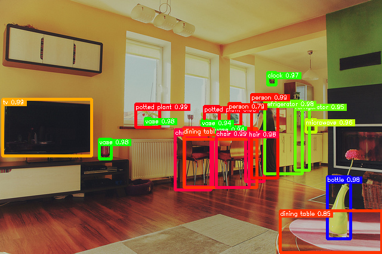

[ailia MODELS](../README.md) > Object detection

# ailia MODELS : Object detection

[Accuracy metrics](./METRICS.md)

### CNN

| | Model | Reference | Exported From | Supported Ailia Version | Date | Blog |
|:-----------|------------:|:------------:|:------------:|:------------:|:------------:|:------------:|
|  | [yolov1-tiny](./yolov1-tiny/) | [YOLO: Real-Time Object Detection](https://pjreddie.com/darknet/yolov1/) | Darknet | 1.1.0 and later | Jun 2015 | [JP](https://tech.ailia.ai/yolov1-you-look-only-once%E9%AB%98%E9%80%9F%E3%81%AA%E7%89%A9%E4%BD%93%E6%A4%9C%E5%87%BA%E3%83%A2%E3%83%87%E3%83%AB-92141aab4b69) |
|  | [yolov2](./yolov2/) | [YOLO: Real-Time Object Detection](https://pjreddie.com/darknet/yolo/) | Pytorch | 1.2.0 and later | Dec 2016 | [JP](https://tech.ailia.ai/yolov2-%E3%82%88%E3%82%8A%E8%89%AF%E3%81%8F-%E3%82%88%E3%82%8A%E9%80%9F%E3%81%8F-%E3%82%88%E3%82%8A%E5%BC%B7%E3%81%8F-16e09c11476a) |
|  | [yolov2-tiny](./yolov2-tiny/) | [YOLO: Real-Time Object Detection](https://pjreddie.com/darknet/yolo/) | Pytorch | 1.2.6 and later | Dec 2016 | |
|  | [maskrcnn](./maskrcnn/) | [Mask R-CNN: real-time neural network for object instance segmentation](https://github.com/onnx/models/tree/master/vision/object_detection_segmentation/mask-rcnn) | Pytorch | 1.2.3 and later | Mar 2017 | |
|  | [yolov3](./yolov3/) | [YOLO: Real-Time Object Detection](https://pjreddie.com/darknet/yolo/) | ONNX Runtime | 1.2.1 and later | Apr 2018 | [EN](https://tech.ailia.ai/en/yolov3-a-machine-learning-model-to-detect-the-position-and-type-of-an-object-60f1c18f8107) [JP](https://tech.ailia.ai/yolov3-66c9b998c096) |
|  | [yolov3-tiny](./yolov3-tiny/) | [YOLO: Real-Time Object Detection](https://pjreddie.com/darknet/yolo/) | ONNX Runtime | 1.2.1 and later | Apr 2018 | |
|  | [mobilenet_ssd](./mobilenet_ssd/) | [MobileNetV1, MobileNetV2, VGG based SSD/SSD-lite implementation in Pytorch](https://github.com/qfgaohao/pytorch-ssd) | Pytorch | 1.2.1 and later | Aug 2018 | [EN](https://tech.ailia.ai/en/mobilenetssd-a-machine-learning-model-for-fast-object-detection-37352ce6da7d) [JP](https://tech.ailia.ai/mobilenetssd-%E9%AB%98%E9%80%9F%E3%81%AB%E7%89%A9%E4%BD%93%E6%A4%9C%E5%87%BA%E3%82%92%E8%A1%8C%E3%81%86%E6%A9%9F%E6%A2%B0%E5%AD%A6%E7%BF%92%E3%83%A2%E3%83%87%E3%83%AB-be3ca37c411) |
|  | [m2det](./m2det/) | [M2Det: A Single-Shot Object Detector based on Multi-Level Feature Pyramid Network](https://github.com/qijiezhao/M2Det) | Pytorch | 1.2.3 and later | Nov 2018 | [EN](https://tech.ailia.ai/en/m2det-highly-accurate-object-detection-model-b5c5bff27970) [JP](https://tech.ailia.ai/m2det-%E9%AB%98%E7%B2%BE%E5%BA%A6%E3%81%AA%E7%89%A9%E4%BD%93%E6%A4%9C%E5%87%BA%E3%83%A2%E3%83%87%E3%83%AB-bf92a8a3d423) |
|  | [centernet](./centernet/) | [CenterNet : Objects as Points](https://github.com/xingyizhou/CenterNet) | Pytorch | 1.2.1 and later | Apr 2019 | [EN](https://tech.ailia.ai/en/centernet-a-machine-learning-model-for-anchorless-object-detection-462c48483cfe) [JP](https://tech.ailia.ai/centernet-%E3%82%A2%E3%83%B3%E3%82%AB%E3%83%BC%E3%83%AC%E3%82%B9%E3%81%AA%E7%89%A9%E4%BD%93%E6%A4%9C%E5%87%BA%E3%82%92%E8%A1%8C%E3%81%86%E6%A9%9F%E6%A2%B0%E5%AD%A6%E7%BF%92%E3%83%A2%E3%83%87%E3%83%AB-9ecbadefd884) |
|  | [yolact](./yolact/) | [You Only Look At CoefficienTs](https://github.com/dbolya/yolact) | Pytorch | 1.2.6 and later | Apr 2019 | |
|  | [efficientdet](./efficientdet/) | [EfficientDet: Scalable and Efficient Object Detection, in PyTorch](https://github.com/toandaominh1997/EfficientDet.Pytorch) | Pytorch | 1.2.6 and later | Nov 2019 | |
|  | [pedestrian_detection](./pedestrian_detection/) | [Pedestrian-Detection-on-YOLOv3_Research-and-APP](https://github.com/Zyjacya-In-love/Pedestrian-Detection-on-YOLOv3_Research-and-APP) | Keras | 1.2.1 and later | Mar 2020 | |
|  | [crowd_det](./crowd_det/) | [Detection in Crowded Scenes](https://github.com/Purkialo/CrowdDet) | Pytorch | 1.2.13 and later | Mar 2020 | |
|  | [yolov4](./yolov4/) | [Pytorch-YOLOv4](https://github.com/Tianxiaomo/pytorch-YOLOv4) | Pytorch | 1.2.4 and later | Apr 2020 | [EN](https://tech.ailia.ai/en/yolov4-a-machine-learning-model-to-detect-the-position-and-type-of-an-object-4f108ed0507b) [JP](https://tech.ailia.ai/yolov4-%E7%89%A9%E4%BD%93%E3%82%92%E6%A4%9C%E5%87%BA%E3%81%99%E3%82%8B%E6%A9%9F%E6%A2%B0%E5%AD%A6%E7%BF%92%E3%83%A2%E3%83%87%E3%83%AB-480f0a635317) |
|  | [yolov4-tiny](./yolov4-tiny/) | [Pytorch-YOLOv4](https://github.com/Tianxiaomo/pytorch-YOLOv4) | Pytorch | 1.2.5 and later | Apr 2020 | |
|  | [yolov5](./yolov5/) | [yolov5](https://github.com/ultralytics/yolov5) | Pytorch | 1.2.5 and later | May 2020 | [EN](https://tech.ailia.ai/en/yolov5-the-latest-model-for-object-detection-b13320ec516b) [JP](https://tech.ailia.ai/yolov5-%E7%89%A9%E4%BD%93%E6%A4%9C%E5%87%BA%E3%81%AE%E6%9C%80%E6%96%B0%E3%83%A2%E3%83%87%E3%83%AB-5b7316d1e54d) |
|  | [poly_yolo](./poly_yolo/) | [Poly YOLO](https://gitlab.com/irafm-ai/poly-yolo/) | Keras | 1.2.6 and later | May 2020 | |
|  | [nanodet](./nanodet/) | [NanoDet](https://github.com/RangiLyu/nanodet) | Pytorch | 1.2.6 and later | Nov 2020 | |
|  | [yolor](./yolor/) | [yolor](https://github.com/WongKinYiu/yolor/tree/paper) | Pytorch | 1.2.5 and later | May 2021 | |
|  | [yolox](./yolox/) | [YOLOX](https://github.com/Megvii-BaseDetection/YOLOX) | Pytorch | 1.2.6 and later | Jul 2021 | [EN](https://tech.ailia.ai/en/yolox-object-detection-model-exceeding-yolov5-d6cea6d3c4bc) [JP](https://tech.ailia.ai/yolox-yolov5%E3%82%92%E8%B6%85%E3%81%88%E3%82%8B%E7%89%A9%E4%BD%93%E6%A4%9C%E5%87%BA%E3%83%A2%E3%83%87%E3%83%AB-e9706e15fef2) |
|  | [picodet](./picodet/) | [PP-PicoDet](https://github.com/Bo396543018/Picodet_Pytorch) | Pytorch | 1.2.10 and later | Nov 2021 | [JP](https://tech.ailia.ai/picodet-%E3%83%A2%E3%83%90%E3%82%A4%E3%83%ABcpu%E3%81%AB%E6%9C%80%E9%81%A9%E5%8C%96%E3%81%97%E3%81%9F%E9%AB%98%E9%80%9F%E3%81%AA%E7%89%A9%E4%BD%93%E6%A4%9C%E5%87%BA%E3%83%A2%E3%83%87%E3%83%AB-837ec39ec8e1) |
|  | [yolox-ti-lite](./yolox-ti-lite/) | [edgeai-yolox](https://github.com/TexasInstruments/edgeai-yolox) | Pytorch | 1.2.9 and later | Dec 2021 | |
|  | [yolov7](./yolov7/) | [YOLOv7](https://github.com/WongKinYiu/yolov7) | Pytorch | 1.2.7 and later | Jul 2022 | |
|  | [fastest-det](./fastest-det/) | [FastestDet](https://github.com/dog-qiuqiu/FastestDet) | Pytorch | 1.2.5 and later | Jul 2022 | |
|  | [yolov](./yolov/) | [YOLOV](https://github.com/YuHengsss/YOLOV) | Pytorch | 1.2.10 and later | Aug 2022 | |
|  | [yolov6](./yolov6/) | [YOLOV6](https://github.com/meituan/YOLOv6) | Pytorch | 1.2.10 and later | Sep 2022 | |
|  | [damo_yolo](./damo_yolo/) | [DAMO-YOLO](https://github.com/tinyvision/DAMO-YOLO) | Pytorch | 1.2.9 and later | Nov 2022 | |
|  | [yolov8](./yolov8/) | [YOLOv8](https://github.com/ultralytics/ultralytics) | Pytorch | 1.2.14.1 and later | Jan 2023 | |
|  | [yolox_body_head_hand_face](./yolox_body_head_hand_face/) | [YOLOX-Body-Head-Hand-Face](https://github.com/PINTO0309/PINTO_model_zoo/tree/main/434_YOLOX-Body-Head-Hand-Face) | Pytorch | 1.2.15 and later | Jan 2024 | |
|  | [yolov9](./yolov9/) | [YOLOv9](https://github.com/WongKinYiu/yolov9) | Pytorch | 1.2.10 and later | Feb 2024 |  |
|  | [yolov10](./yolov10/) | [YOLOv10](https://github.com/THU-MIG/yolov10) | Pytorch | 1.2.11 and later | May 2024 |  |
|  | [yolov11](./yolov11/) | [YOLOv11](https://github.com/ultralytics/ultralytics) | Pytorch | 1.2.14 and later | Sep 2024 |  |
|  | [yolov12](./yolov12/) | [YOLOv12](https://github.com/sunsmarterjie/yolov12) | Pytorch | 1.2.14 and later | Feb 2025 |  |

### Transformer

| | Model | Reference | Exported From | Supported Ailia Version | Date | Blog |
|:-----------|------------:|:------------:|:------------:|:------------:|:------------:|:------------:|
|  | [detr](./detr/) | [End-to-End Object Detection with Transformers (DETR)](https://github.com/facebookresearch/detr) | Pytorch | 1.2.16 and later | May 2020 ||
|  | [glip](./glip/) | [GLIP](https://github.com/microsoft/GLIP) | Pytorch | 1.2.13 and later | Dec 2021 | |
|  | [dab-detr](./dab-detr/) | [DAB-DETR](https://github.com/IDEA-opensource/DAB-DETR) | Pytorch | 1.2.12 and later | Jan 2022 | |
|  | [detic](./detic/) | [Detecting Twenty-thousand Classes using Image-level Supervision](https://github.com/facebookresearch/Detic) | Pytorch | 1.2.10 and later | Jan 2022 | [EN](https://medium.com/p/49cba412b7d4) [JP](https://tech.ailia.ai/detic-21k%E3%82%AF%E3%83%A9%E3%82%B9%E3%82%92%E9%AB%98%E7%B2%BE%E5%BA%A6%E3%81%AB%E3%82%BB%E3%82%B0%E3%83%A1%E3%83%B3%E3%83%86%E3%83%BC%E3%82%B7%E3%83%A7%E3%83%B3%E3%81%A7%E3%81%8D%E3%82%8B%E7%89%A9%E4%BD%93%E6%A4%9C%E5%87%BA%E3%83%A2%E3%83%87%E3%83%AB-1b8f777ee89a) |
|  | [groundingdino](./groundingdino/) | [Grounding DINO](https://github.com/IDEA-Research/GroundingDINO/tree/main) | Pytorch | 1.2.16 and later | Mar 2023 | [EN](https://tech.ailia.ai/en/grounding-dino-detect-any-object-from-text-29808580cb32/) [JP](https://tech.ailia.ai/grounding-dino-%E4%BB%BB%E6%84%8F%E3%81%AE%E7%89%A9%E4%BD%93%E3%82%92%E6%A4%9C%E5%87%BA%E3%81%A7%E3%81%8D%E3%82%8B%E7%89%A9%E4%BD%93%E6%A4%9C%E5%87%BA%E3%83%A2%E3%83%87%E3%83%AB-3cc87db64f0c) |
|  | [rt-detr-v2](./rt-detr-v2/) | [RT-DETR](https://github.com/lyuwenyu/RT-DETR) | Pytorch | 1.2.13 and later | Jul 2024 |[EN](https://tech.ailia.ai/en/rt-detr-hybrid-object-detection-model-combining-convolution-and-transformer-26809f9fd742/) [JP](https://tech.ailia.ai/rt-detr-convolution%E3%81%A8transformer%E3%81%AE%E3%83%8F%E3%82%A4%E3%83%96%E3%83%AA%E3%83%83%E3%83%89%E3%81%AA%E7%89%A9%E4%BD%93%E6%A4%9C%E5%87%BA%E3%83%A2%E3%83%87%E3%83%AB-7b73fd6a8de9) |

### Specific target

| | Model | Reference | Exported From | Supported Ailia Version | Date | Blog |
|:-----------|------------:|:------------:|:------------:|:------------:|:------------:|:------------:|
|  | [traffic-sign-detection](./traffic-sign-detection/) | [Traffic Sign Detection](https://github.com/aarcosg/traffic-sign-detection) | Tensorflow | 1.2.10 and later | Aug 2018 | [EN](https://tech.ailia.ai/en/trafficsigndetection-machine-learning-model-to-detect-road-signs-76d7c175ee01) [JP](https://tech.ailia.ai/trafficsigndetection-%E9%81%93%E8%B7%AF%E6%A8%99%E8%AD%98%E3%82%92%E6%A4%9C%E5%87%BA%E3%81%A7%E3%81%8D%E3%82%8B%E6%A9%9F%E6%A2%B0%E5%AD%A6%E7%BF%92%E3%83%A2%E3%83%87%E3%83%AB-d1dc1bd5ff5e) |
|  | [sku110k-densedet](./sku110k-densedet/) | [SKU110K-DenseDet](https://github.com/Media-Smart/SKU110K-DenseDet) | Pytorch | 1.2.9 and later | Apr 2019 | [EN](https://tech.ailia.ai/en/sku110k-densedet-a-machine-learning-model-that-can-detect-products-in-a-store-baf9d98cb441) [JP](https://tech.ailia.ai/sku110k-densedet-%E5%BA%97%E8%88%97%E5%86%85%E3%81%AE%E5%95%86%E5%93%81%E3%82%92%E6%A4%9C%E5%87%BA%E3%81%A7%E3%81%8D%E3%82%8B%E6%A9%9F%E6%A2%B0%E5%AD%A6%E7%BF%92%E3%83%A2%E3%83%87%E3%83%AB-b775184b5e46) |
|  | [footandball](./footandball/) | [FootAndBall: Integrated player and ball detector](https://github.com/jac99/FootAndBall) | Pytorch | 1.2.0 and later | Dec 2019 | |
|  | [qrcode_wechatqrcode](./qrcode_wechatqrcode/) | [qrcode_wechatqrcode](https://github.com/opencv/opencv_zoo/tree/4fb591053ba1201c07c68929cc324787d5afaa6c/models/qrcode_wechatqrcode) | Caffe | 1.2.15 and later | Mar 2021 | |
|  | [mobile_object_localizer](./mobile_object_localizer/) | [mobile_object_localizer_v1](https://tfhub.dev/google/object_detection/mobile_object_localizer_v1/1) | TensorFlow Hub | 1.2.6 and later | Jun 2021 | [EN](https://tech.ailia.ai/en/mobileobjectlocalizer-class-agnostic-mobile-object-detector-b740c0ceb16c) [JP](https://tech.ailia.ai/mobileobjectlocalizer-%E4%BB%BB%E6%84%8F%E3%81%AE%E7%89%A9%E4%BD%93%E3%82%92%E6%A4%9C%E5%87%BA%E3%81%A7%E3%81%8D%E3%82%8B%E7%89%A9%E4%BD%93%E6%A4%9C%E5%87%BA%E3%83%A2%E3%83%87%E3%83%AB-595b54cfab26) |
|  |[layout_parsing](./layout_parsing/)  | [unstructured-inference](https://github.com/Unstructured-IO/unstructured-inference/tree/main) | Pytorch | 1.2.9 and later | Dec 2022 | |

[Back to the model list](../README.md)
