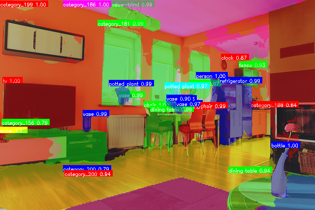

# DETR

## Input


## Output

### Object Detection (r50)


### Panoptic Segmentation (resnet101_panoptic)



## Usage

Automatically downloads the onnx and prototxt files on the first run.
It is necessary to be connected to the Internet while downloading.

For the sample image, run object detection with the default model:

```bash
$ python3 detr.py
```

To run panoptic segmentation, add the `--segment` flag:

```bash
$ python3 detr.py --segment
```

You can use the `--input` option to specify the input image and `--savepath` to change the output filename.

```bash
$ python3 detr.py --input IMAGE_PATH --savepath SAVE_IMAGE_PATH
```

By adding the `--video` option, you can input video.
If you pass `0` as an argument to VIDEO_PATH, you can use the webcam input instead of the video file.

```bash
$ python3 detr.py --video VIDEO_PATH
```

| Option | Model | Task |
|---|---|---|
| (default) | DETR-R50 | Object detection (COCO 80 classes) |
| `--segment` | DETR-ResNet101-Panoptic | Panoptic segmentation (things + stuff) |

The detection threshold can be changed with `--threshold` (default: 0.7).

```bash
$ python3 detr.py --threshold 0.9
```

## Reference

[End-to-End Object Detection with Transformers (DETR)](https://github.com/facebookresearch/detr)

## Framework

PyTorch

## Model Format

ONNX opset = 17

## Netron

[detr-r50-e632da11.onnx.prototxt](https://netron.app/?url=https://storage.googleapis.com/ailia-models/detr/detr-r50-e632da11.onnx.prototxt)

[detr_resnet101_panoptic.onnx.prototxt](https://netron.app/?url=https://storage.googleapis.com/ailia-models/detr/detr_resnet101_panoptic.onnx.prototxt)
