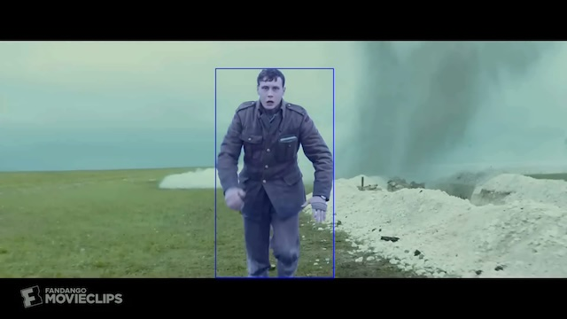

[ailia MODELS](../README.md) > Object tracking

# ailia MODELS : Object tracking

| | Model | Reference | Exported From | Supported Ailia Version | Date | Blog |
|:-----------|------------:|:------------:|:------------:|:------------:|:------------:|:------------:|
|  | [deepsort](./deepsort/) | [Deep Sort with PyTorch](https://github.com/ZQPei/deep_sort_pytorch) | Pytorch | 1.2.3 and later | Mar 2017 | [EN](https://tech.ailia.ai/en/deepsort-a-machine-learning-model-for-tracking-people-1170743b5984) [JP](https://tech.ailia.ai/deepsort-%E4%BA%BA%E7%89%A9%E3%81%AE%E3%83%88%E3%83%A9%E3%83%83%E3%82%AD%E3%83%B3%E3%82%B0%E3%82%92%E8%A1%8C%E3%81%86%E6%A9%9F%E6%A2%B0%E5%AD%A6%E7%BF%92%E3%83%A2%E3%83%87%E3%83%AB-e8cb7410457c) |
|  | [person_reid_baseline_pytorch](./person_reid_baseline_pytorch/) | [UTS-Person-reID-Practical](https://github.com/layumi/Person_reID_baseline_pytorch) | Pytorch | 1.2.6 and later | Mar 2019 | |
|  | [abd_net](./abd_net/) | [Attentive but Diverse Person Re-Identification](https://github.com/VITA-Group/ABD-Net) | Pytorch | 1.2.7 and later | Aug 2019 | |
|  | [deepsort_vehicle](./deepsort_vehicle/) | [Multi-Camera Live Object Tracking](https://github.com/LeonLok/Multi-Camera-Live-Object-Tracking) | Pytorch | 1.2.9 and later | May 2020 |  |
|  | [qd-3dt](./qd-3dt/) | [Monocular Quasi-Dense 3D Object Tracking](https://github.com/SysCV/qd-3dt) | Pytorch | 1.2.11 and later | Mar 2021 |　|
|  | [centroids-reid](./centroids-reid/) | [On the Unreasonable Effectiveness of Centroids in Image Retrieval](https://github.com/mikwieczorek/centroids-reidh) | Pytorch | 1.2.9 and later | Apr 2021 |　|
|  | [siam-mot](./siam-mot/) | [SiamMOT](https://github.com/amazon-research/siam-mot) | Pytorch | 1.2.9 and later | May 2021 | |
|  | [bytetrack](./bytetrack/) | [ByteTrack](https://github.com/ifzhang/ByteTrack) | Pytorch | 1.2.5 and later | Oct 2021 | [EN](https://tech.ailia.ai/en/bytetrack-tracking-model-that-also-considers-low-accuracy-bounding-boxes-17f5ed70e00c) [JP](https://tech.ailia.ai/bytetrack-%E4%BD%8E%E3%81%84%E7%A2%BA%E5%BA%A6%E3%81%AEboundingbox%E3%82%82%E8%80%83%E6%85%AE%E3%81%99%E3%82%8B%E3%83%88%E3%83%A9%E3%83%83%E3%82%AD%E3%83%B3%E3%82%B0%E3%83%A2%E3%83%87%E3%83%AB-244b994d5afb)　|
|  | [strong_sort](./strong_sort/) | [StrongSORT](https://github.com/dyhBUPT/StrongSORT) | Pytorch | 1.2.15 and later | Feb 2022 |　|
|  | [samurai](./samurai/) | [SAMURAI: Adapting Segment Anything Model for Zero-Shot Visual Tracking with Motion-Aware Memory](https://github.com/yangchris11/samurai) | Pytorch | 1.6.1 and later | Nov 2024 |  |

[Back to the model list](../README.md)
