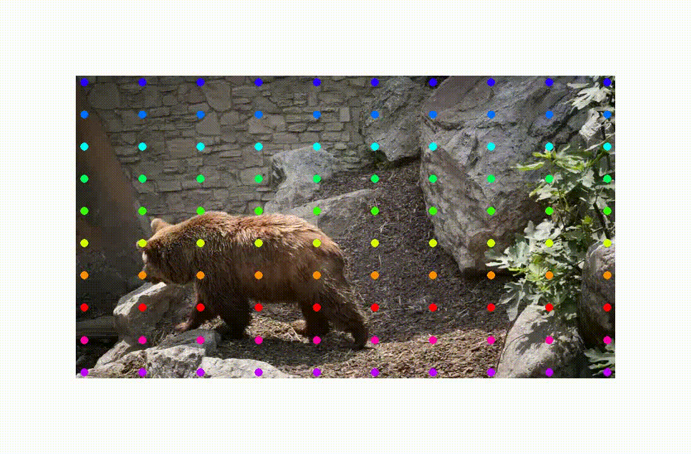

[ailia MODELS](../README.md) > Optical Flow Estimation

# ailia MODELS : Optical Flow Estimation

| | Model | Reference | Exported From | Supported Ailia Version | Date | Blog |
|:-----------|------------:|:------------:|:------------:|:------------:|:------------:|:------------:|
|  | [raft](./raft/) | [RAFT: Recurrent All Pairs Field Transforms for Optical Flow](https://github.com/princeton-vl/RAFT) | Pytorch | 1.2.6 and later | Mar 2020 | [EN](https://tech.ailia.ai/en/raft-a-machine-learning-model-for-estimating-optical-flow-6ab6d077e178) [JP](https://tech.ailia.ai/raft-optical-flow%E3%82%92%E6%8E%A8%E5%AE%9A%E3%81%99%E3%82%8B%E6%A9%9F%E6%A2%B0%E5%AD%A6%E7%BF%92%E3%83%A2%E3%83%87%E3%83%AB-bf898965de05)　|
|  | [cotracker3](./cotracker3/) | [ CoTracker3: Simpler and Better Point Tracking by Pseudo-Labelling Real Videos](https://github.com/facebookresearch/co-tracker) | Pytorch | 1.6.1 and later | Oct 2024 |  |

[Back to the model list](../README.md)
