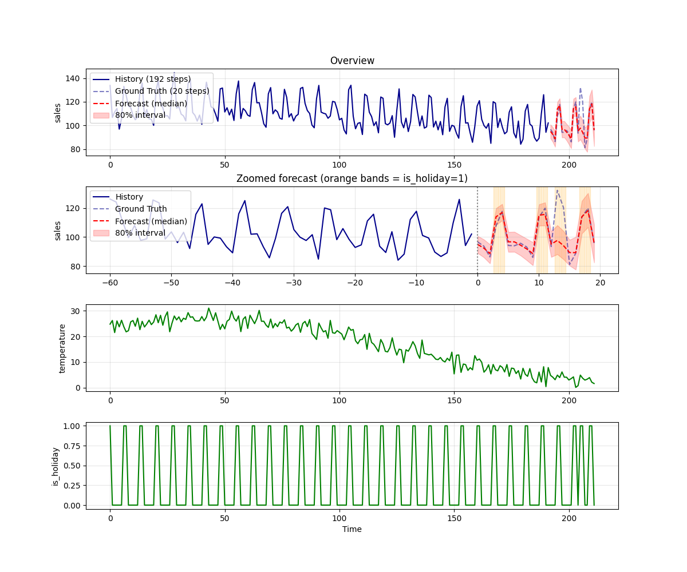

# Chronos-2

Chronos-2 is Amazon's 120M-parameter encoder-only time-series foundation
model. It supports zero-shot univariate, multivariate, and
**covariate-informed** forecasting in a single architecture, and is
distributed under Apache-2.0.

## Input
A CSV file containing a `date` column, one target column, and (optionally)
extra covariate columns whose future values are known.

The default `input.csv` is a synthetic convenience-store (konbini) sales
example with `sales`, `temperature`, and `is_holiday` columns:

```
        date       sales  temperature  is_holiday
2023-01-01  111.936281     4.100060           1
2023-01-02  120.335880     2.804389           1
2023-01-03  117.991534     4.354113           1
...
```

## Output



The forecast plot shows historical observations (solid blue), the held-out
ground truth (dashed blue), the median forecast (red dashed) and the 80%
prediction interval shaded in red. When covariates are provided, their values
are plotted in the lower panels.

## Usage
Automatically downloads the onnx and prototxt files on the first run.
It is necessary to be connected to the Internet while downloading.

```bash
$ python3 chronos2.py
```

To replicate the konbini covariate example:

```bash
$ python3 chronos2.py --target sales --feat temperature,is_holiday \
                     --context_len 192 --prediction_len 20
```

The forecast horizon (`--prediction_len`) and the size of the past context
window (`--context_len`) are configurable. Note that the exported ONNX
model has a **fixed** prediction length determined by the
``--num_output_patches`` value used at export time (4 in the shipped
graph, giving 4×16 = 64 steps). The script trims the output to
``--prediction_len`` so any value up to 64 is OK; for longer horizons,
re-export the ONNX with a larger ``--num_output_patches``.

By default the ailia SDK is used. Pass `--onnx` to use ONNX Runtime instead.

## Reference

- [Chronos-2 paper (arXiv:2510.15821)](https://arxiv.org/abs/2510.15821)
- [Hugging Face: amazon/chronos-2](https://huggingface.co/amazon/chronos-2)
- [Amazon Science: chronos-forecasting](https://github.com/amazon-science/chronos-forecasting)

## Framework

PyTorch + chronos-forecasting (Apache-2.0)

## Model Format

ONNX opset = 17

## Netron

[chronos-2-p4.onnx.prototxt](https://netron.app/?url=https://storage.googleapis.com/ailia-models/chronos2/chronos-2-p4.onnx.prototxt)

## Notes

The exported ONNX corresponds to `Chronos2Model.forward` with the
following adaptations applied at trace time:

- `F.scaled_dot_product_attention` is replaced with a manual
  matmul/softmax to work around an opset-17 exporter bug on the `scale`
  argument.
- `torch.nanmean` and `torch.arcsinh` / `torch.sinh` (used by
  `InstanceNorm`) are replaced with closed-form NaN-safe equivalents
  (`Sum`/`Where`, `log(x + sqrt(x²+1))`, `(eˣ-e⁻ˣ)/2`).
- `Patch` switches from `tensor.unfold` to `reshape` (valid because
  `patch_size == patch_stride == 16` for Chronos-2).
- A post-processing pass rewrites a single `ConstantOfShape -> Gather`
  chain (used for the `[REG]` token id lookup) from FLOAT to INT64.

## Re-exporting the model

If you need a different prediction-horizon length, re-export with a
different ``--num_output_patches`` (max 64 → 1024 steps):

```bash
$ cd export
$ python3 export_chronos2.py --num_output_patches 4  --output_dir ..
$ python3 export_chronos2.py --num_output_patches 8  --output_dir ..   # 128-step horizon
```

The accompanying `.prototxt` is produced by ailia's
[onnx2prototxt](https://github.com/ailia-ai/export-to-onnx/blob/master/onnx2prototxt.py):

```bash
$ python3 onnx2prototxt.py ../chronos-2-p4.onnx
```
