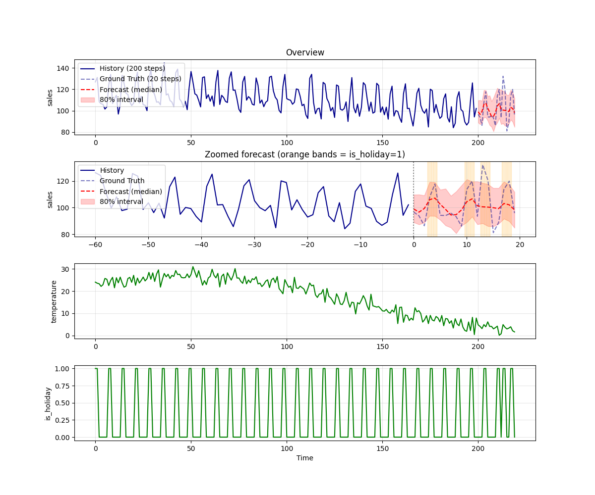

# Moirai

Moirai (Salesforce uni2ts) is a Universal Time Series Transformer that supports
zero-shot forecasting and accepts known-future covariates (`feat_dynamic_real`).
This makes it suitable for use cases where exogenous signals such as temperature
or holidays influence the target series.

## Weights provenance & license

The published Moirai-1.0-R weights on Hugging Face were originally released
under **Apache-2.0**. Salesforce relicensed the same Hugging Face repositories
to **CC-BY-NC-4.0** on 2024-03-28, but Apache-2.0 grants are perpetual and
irrevocable for releases that already happened.

This export pulls each model from the **last commit before the relicense**,
where the README still declares `license: apache-2.0`. The downloaded
artifact is the legacy `model.ckpt` (PyTorch Lightning checkpoint), which is
loaded into a fresh `MoiraiModule` and exported to ONNX.

| Size  | Hugging Face revision | Date       | README license |
|-------|-----------------------|------------|----------------|
| small | `4a950dea3b2c38b9675082959109e1b36d40ab16` | 2024-03-26 | `apache-2.0`   |
| base  | `03e0d0f88ea7dee295d398d102fb582494b549e1` | 2024-03-26 | `apache-2.0`   |
| large | `bc5caba1947b76c9efd513ada3675b8d5006f09a` | 2024-03-26 | `apache-2.0`   |

Note that **Moirai-1.1-R weights were never released under Apache-2.0**, so
they are not used here.

## Input
A CSV file containing a `date` column, one target column, and (optionally)
extra covariate columns whose future values are known.

The default `input.csv` is a synthetic convenience-store (konbini) sales
example with `sales`, `temperature`, and `is_holiday` columns:

```
        date       sales  temperature  is_holiday
2023-01-01  111.936281     4.100060           1
2023-01-02  120.335880     2.804389           1
2023-01-03  117.991534     4.354113           1
...
```

## Output



The forecast plot shows historical observations (solid blue), the held-out
ground truth (dashed blue), the median forecast (red dashed) and the 80%
prediction interval shaded in red. When covariates are provided, their values
are plotted in the lower panels.

## Usage
Automatically downloads the onnx and prototxt files on the first run.
It is necessary to be connected to the Internet while downloading.

```bash
$ python3 moirai.py
```

A target column and (optional) covariate columns may be specified. To replicate
the konbini example from
[issue #1854](https://github.com/ailia-ai/ailia-models/issues/1854):

```bash
$ python3 moirai.py --target sales --feat temperature,is_holiday --patch_size 32
```

You can switch between the three publicly released Moirai-1.0-R sizes (each
corresponds to a separate ONNX file):

```bash
$ python3 moirai.py --size small   # 54 MB
$ python3 moirai.py --size base    # 350 MB
$ python3 moirai.py --size large   # default, 1.2 GB
```

`large` is the default because Moirai-1.0-R's covariate utilisation is
weakest at the small size; see the
[patch-size table](#choosing---patch_size-when-using-covariates) below.

The forecast horizon and the size of the past context window are configurable
with `--prediction_len` and `--context_len`. The Moirai patch size can either
be selected automatically by Moirai (`--patch_size auto`, the default) or fixed
to one of `8`, `16`, `32`, `64`, `128`:

```bash
$ python3 moirai.py --context_len 512 --prediction_len 64 --patch_size 32
```

The probabilistic forecast is built from `--num_samples` samples drawn from the
predictive mixture distribution; a larger value gives smoother quantile
estimates at the cost of inference time:

```bash
$ python3 moirai.py --num_samples 200 --seed 0
```

By default the ailia SDK is used. Pass `--onnx` to use ONNX Runtime instead.

### Choosing `--patch_size` when using covariates

Moirai compresses every `patch_size` consecutive timesteps of each variable
(target *and* `feat_dynamic_real`) into a single transformer token. If
`patch_size` is too large, day-level covariate spikes (e.g. `is_holiday=1`
on Dec 24-25) get averaged inside one token and the model can no longer
condition the forecast on them.

The default `--patch_size auto` picks the patch size that minimises the
**past-window** validation loss; this is *not* always the best patch size
for **utilising future covariates**. Measured median forecast gap between
holiday and non-holiday days in the konbini example (reference observed
gap in the context window: +22.34):

| size  | auto  | p=16  | **p=32**  |
|------:|------:|------:|----------:|
| small | -2.84 | -0.54 | **+2.27** |
| base  | +0.35 | +0.14 | **+3.02** |
| large | +0.90 | +0.19 | **+5.26** |

For covariate-driven forecasts with Moirai-1.0-R, `--patch_size 32` is the
recommended setting; `auto` tends to pick a coarser patch size that erases
the covariate signal. Larger model sizes only modestly improve covariate
uptake, so the patch size is the dominant factor.

(Moirai-1.1-R's covariate handling was reportedly improved over 1.0-R, but
its weights were never released under Apache-2.0 and are not used here.)

## Reference

- [Salesforce uni2ts](https://github.com/SalesforceAIResearch/uni2ts)
- [Moirai paper (arXiv:2402.02592)](https://arxiv.org/abs/2402.02592)
- [Hugging Face: Moirai-1.0-R-small (Apache-2.0 revision)](https://huggingface.co/Salesforce/moirai-1.0-R-small/tree/4a950dea3b2c38b9675082959109e1b36d40ab16)

## Framework

PyTorch + uni2ts (Apache-2.0)

## Model Format

ONNX opset = 17

## Netron

[moirai-1.0-R-small.onnx.prototxt](https://netron.app/?url=https://storage.googleapis.com/ailia-models/moirai/moirai-1.0-R-small.onnx.prototxt)

[moirai-1.0-R-base.onnx.prototxt](https://netron.app/?url=https://storage.googleapis.com/ailia-models/moirai/moirai-1.0-R-base.onnx.prototxt)

[moirai-1.0-R-large.onnx.prototxt](https://netron.app/?url=https://storage.googleapis.com/ailia-models/moirai/moirai-1.0-R-large.onnx.prototxt)

## Notes

The exported ONNX graph corresponds to Moirai's transformer encoder and the
distribution-parameter projection. The pre-processing (target/covariate
patching, time index generation) and post-processing (mixture sampling,
de-patching of the forecast) are performed in Python through the
[`uni2ts`](https://github.com/SalesforceAIResearch/uni2ts) and
[`gluonts`](https://github.com/awslabs/gluonts) libraries, which are therefore
required at inference time:

```bash
$ pip install uni2ts gluonts
```

The inference script downloads `model.ckpt` from the pinned Apache-2.0
revision (e.g. `Salesforce/moirai-1.0-R-small @ 4a950dea3b...`) so that the
distribution-output object can be reconstructed. The ONNX file alone does
not encode the mixture-component metadata.

## Re-exporting the model

If you want to regenerate the ONNX file (for example after upgrading uni2ts),
use the scripts under `export/`. There is one script per Moirai-1.x family:

- `export_moirai_1_0.py` — Apache-2.0 era weights, pinned by revision
  hash. This is what the shipped ONNX file is built from.
- `export_moirai_1_1.py` — Moirai-1.1-R weights from the current
  `main` revision (CC-BY-NC-4.0). For research / non-commercial
  evaluation only.

```bash
$ cd export
# Moirai-1.0-R (Apache-2.0)
$ python3 export_moirai_1_0.py --size small  --output_dir ..
$ python3 export_moirai_1_0.py --size base   --output_dir ..
$ python3 export_moirai_1_0.py --size large  --output_dir ..

# Moirai-1.1-R (CC-BY-NC-4.0)
$ python3 export_moirai_1_1.py --size small  --output_dir ..
$ python3 export_moirai_1_1.py --size base   --output_dir ..
$ python3 export_moirai_1_1.py --size large  --output_dir ..
```

The 1.0 export pins the download to the Apache-2.0 revision listed in
[the table above](#weights-provenance--license).

The accompanying `.prototxt` files are produced by ailia's
[onnx2prototxt](https://github.com/ailia-ai/export-to-onnx/blob/master/onnx2prototxt.py):

```bash
$ python3 onnx2prototxt.py ../moirai-1.0-R-small.onnx ../moirai-1.0-R-base.onnx ../moirai-1.0-R-large.onnx
```
