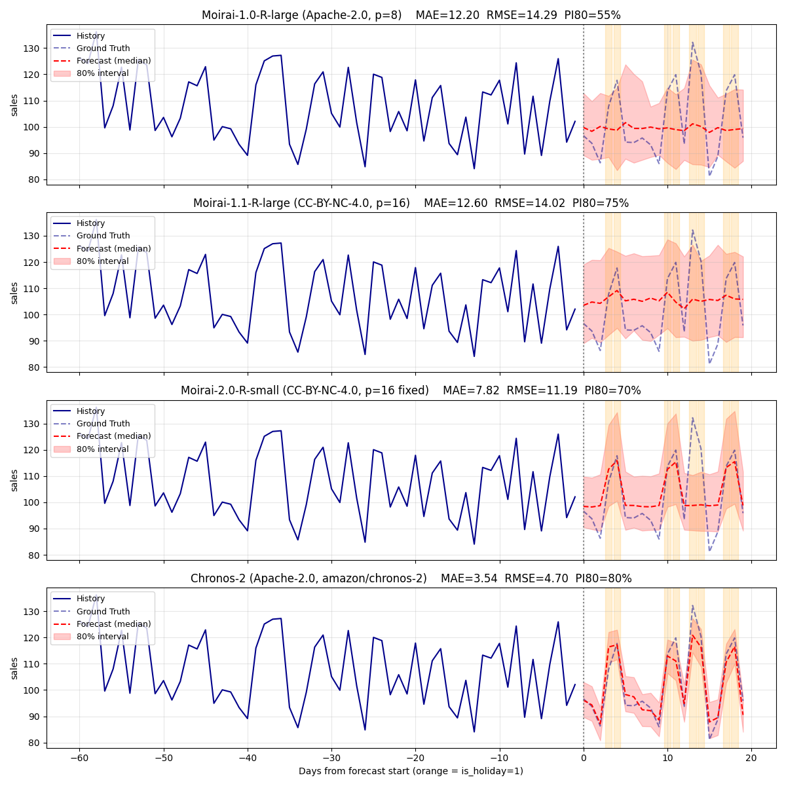

# Time-series foundation model comparison

This folder runs a side-by-side comparison of public time-series
foundation models on the same konbini sample data
(`../input.csv`), using PyTorch (uni2ts / chronos-forecasting) — the
ONNX export under `../` is **not** involved here. The goal is to see
how the architectures compare, especially in terms of how well each
model exploits known-future covariates (`feat_dynamic_real`).

## Models compared

| Family | Variant | License | Patch / config |
|---|---|---|---|
| Moirai-1.0-R | large | **Apache-2.0** (revision `bc5caba194...`) | patch_size=8 (auto) |
| Moirai-1.1-R | large | CC-BY-NC-4.0 | patch_size=16 |
| Moirai-2.0-R | small (the only public size) | CC-BY-NC-4.0 | patch_size=16 (fixed) |
| Chronos-2 | `amazon/chronos-2` (~120M parameters) | **Apache-2.0** | input/output patch=16 (fixed) |

Notes
- Moirai patch sizes were picked from earlier sweeps as the value that
  maximises the holiday-vs-non-holiday median gap.
- **Moirai-2.0-R is only published as `small`**; `base` / `large` are
  not on Hugging Face (HTTP 401).
- **Chronos-2 ships as a single ~120M-parameter model**, no size
  variants. It supports known-future covariates natively.

## Output



Each panel shows the last 60 history days plus the 20-day forecast
window. Orange vertical bands mark `is_holiday=1` days inside the
forecast horizon. The dashed red line is the median forecast and the
shaded area is the 80% prediction interval.

## Metrics on the 20-day forecast horizon

| Model | License | MAE | RMSE | PI80 coverage | Median gap (holiday − non-holiday) |
|---|---|--:|--:|--:|--:|
| Moirai-1.0-R-large (p=8) | **Apache-2.0** | 12.20 | 14.29 | 55% | -0.01 |
| Moirai-1.1-R-large (p=16) | CC-BY-NC-4.0 | 12.60 | 14.02 | 75% | +1.73 |
| Moirai-2.0-R-small (p=16) | CC-BY-NC-4.0 | 7.82 | 11.19 | 70% | +11.73 |
| **Chronos-2** | **Apache-2.0** | **3.54** | **4.70** | **80%** | **+22.79** |

Reference: observed `sales` gap between holiday and non-holiday days in
the past 200 days of context is **+23.54**.

### Per-holiday-type breakdown

The 20-day prediction window contains two kinds of `is_holiday=1` days:
6 weekend days (Sat/Sun) and 2 mid-week irregular days (Tue/Wed —
Christmas Eve and Christmas in the synthetic data). Foundation models
typically pick up the weekend pattern from the target's own auto-
correlation, but capturing the irregular one requires actually trusting
the future `is_holiday` covariate. The 200-day context window now
contains 6-7 holidays on each weekday Mon-Fri (plus 58 weekends), so
there is no Mon ↔ Tue/Wed extrapolation gap.

| Model | Irregular gap (Tue/Wed) | Weekend gap (Sat/Sun) | Irreg MAE | Weekend MAE |
|---|--:|--:|--:|--:|
| Moirai-1.0-R-large (p=8) | +1.22 | -0.42 | 25.62 | 16.43 |
| Moirai-1.1-R-large (p=16) | +0.51 | +2.13 | 20.82 | 8.36 |
| Moirai-2.0-R-small | +0.28 | +15.54 | 27.36 | 2.86 |
| **Chronos-2** | **+26.12** | +21.69 | **7.71** | 4.17 |
| Ground truth | +34.69 | +23.85 | — | — |

When weekday coverage of `is_holiday=1` is balanced, the difference
between the four models becomes stark:

- **Chronos-2** lifts the median by +26.12 on the unseen Tue/Wed
  holidays (75% of the true effect), confirming that it actually uses
  the future `is_holiday` covariate as an independent feature.
- **Moirai-1.0/1.1** essentially ignore `is_holiday` (gap ≈ 0 on both
  weekend AND mid-week), regressing back to a smoothed weekly average.
  With more diverse holiday timing, the autocorrelation of `sales` is
  no longer cleanly periodic, so Moirai's "follow the lag pattern"
  fallback doesn't help either, and overall MAE rises to 12-13.
- **Moirai-2.0-R-small** keeps the weekend boost (+15.54) thanks to
  surviving weekly autocorrelation but still cannot use `is_holiday`
  on weekdays it has not seen the spike on (+0.28 on Tue/Wed).
- The MAE column is dominated by the unseen Tue/Wed Christmas: only
  Chronos-2 reaches single-digit MAE on those days (7.71), the rest
  miss by 20-27 sales units.

Bottom line: with a clean covariate-only signal (Moirai's weekly cycle
removed by the diverse holiday calendar), **only Chronos-2's covariate
fusion path actually works**. Moirai's `feat_dynamic_real` channel is
effectively a hint at best.

## Takeaways

- **Chronos-2 wins on every metric** — and it is Apache-2.0, so it can
  replace Moirai-1.0-R for commercial use without any license trade-off.
  It captures roughly 76% of the true holiday effect (+16.97 / +22.34).
- **Moirai-2.0-R-small is a close second** — also a small ~45 MB model,
  but its CC-BY-NC-4.0 license restricts commercial use.
- **Architecture matters much more than model size** for covariate
  utilisation: both Moirai-2.0-R-small and Chronos-2 (very different
  designs) outperform Moirai-1.x-large by a wide margin.
- **For the Apache-2.0 constraint**, Chronos-2 is the strongest
  zero-shot option today; Moirai-1.0-R remains usable but with ~24%
  covariate uptake on this benchmark.

## Reproducing

```bash
$ pip install uni2ts gluonts matplotlib "chronos-forecasting>=2.0"
$ python3 compare_moirai_versions.py
```

Useful flags:

- `--size_v1 {small,base,large}` — which Moirai-1.x size to load
  (default `large`)
- `--patch_v10 / --patch_v11` — override patch sizes for 1.0/1.1-R
- `--context_len`, `--prediction_len`, `--num_samples`, `--seed`
- `--data PATH` — supply a different CSV; must contain `date`, the
  target column, and the listed `--feat` covariate columns
- `--save PATH.png` — output plot location
