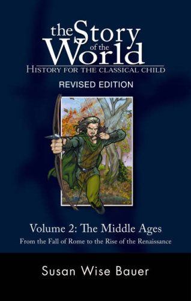

[ailia MODELS](../README.md) > Vision Language Model

# ailia MODELS : Vision Language Model

| | Model | Reference | Exported From | Supported Ailia Version | Date | Blog |
|:-----------|------------:|:------------:|:------------:|:------------:|:------------:|:------------:|
|  | [llava](./llava) | [LLaVA](https://github.com/haotian-liu/LLaVA) | Pytorch | 1.2.16 and later | Apr 2023 | [EN](https://tech.ailia.ai/en/llava-large-language-model-that-understands-images-57d68c321254/) [JP](https://tech.ailia.ai/llava-%E7%94%BB%E5%83%8F%E3%81%AB%E5%AF%BE%E3%81%97%E3%81%A6%E8%B3%AA%E5%95%8F%E3%81%A7%E3%81%8D%E3%82%8B%E5%A4%A7%E8%A6%8F%E6%A8%A1%E8%A8%80%E8%AA%9E%E3%83%A2%E3%83%87%E3%83%AB-6ede836f2bed) |
|  | [florence2](./florence2) | [Hugging Face - microsoft/Florence-2-base](https://huggingface.co/microsoft/Florence-2-base) | Pytorch | 1.2.16 and later | Nov 2023 | [EN](https://tech.ailia.ai/en/florence2-lightweight-vision-language-model-for-edge-deployment-4245f2d8efe1/) [JP](https://tech.ailia.ai/florence2-%E8%BB%BD%E9%87%8F%E3%81%A7%E3%82%A8%E3%83%83%E3%82%B8%E5%AE%9F%E8%A3%85%E5%8F%AF%E8%83%BD%E3%81%AAvision-language-model-71809797a957) |
|  | [mobilevlm](./mobilevlm) | [MobileVLM](https://github.com/Meituan-AutoML/MobileVLM) | Pytorch | 1.5.0 and later | Dec 2023 | |
|  | [llava-jp](./llava-jp) | [LLaVA-JP](https://github.com/tosiyuki/LLaVA-JP/tree/main) | Pytorch | 1.5.0 and later | Jan 2024 | |
|  | [qwen2_vl](./qwen2_vl) | [Qwen2-VL](https://github.com/QwenLM/Qwen2-VL) | Pytorch | 1.5.0 and later | Sep 2024 | [EN](https://tech.ailia.ai/en/qwen2-vl-a-vision-language-model-that-runs-locally-4b97ccab1bf6/) [JP](https://tech.ailia.ai/qwen2-vl-%E3%83%AD%E3%83%BC%E3%82%AB%E3%83%AB%E3%81%A7%E5%8B%95%E4%BD%9C%E3%81%99%E3%82%8Bvision-language-model-b6f75fa30a08) |
|  | [qwen2.5_vl](./qwen2.5_vl) | [Qwen2.5-VL-3B-Instruct](https://huggingface.co/Qwen/Qwen2.5-VL-3B-Instruct#qwen25-vl-3b-instruct) | Pytorch | 1.6.0 and later | Jan 2025 |  |
|  | [qwen3_vl](./qwen3_vl) | [Qwen3-VL](https://github.com/QwenLM/Qwen3-VL) | Pytorch | 1.6.0 and later | Oct 2025 |  |

[Back to the model list](../README.md)
