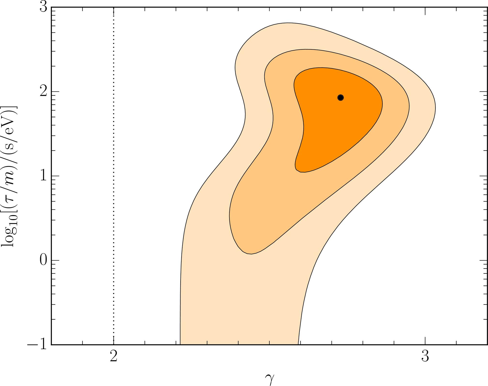
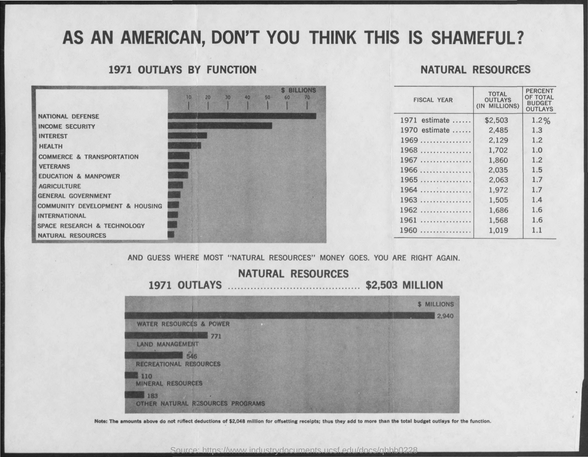
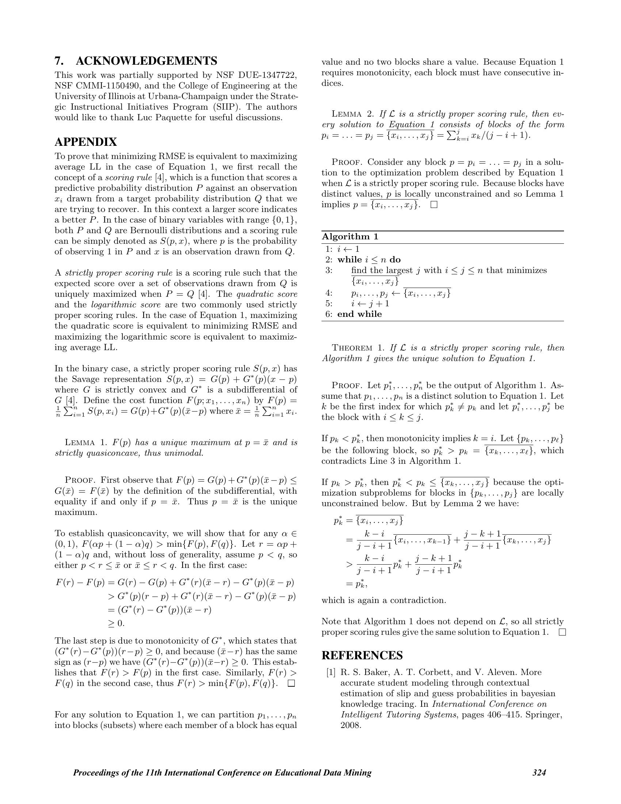

# ColQwen2

ColQwen2 is a visual document retriever based on Qwen2-VL-2B with the ColBERT strategy.
It embeds document page images and text queries into multi-vector representations
(one 128-dim vector per token) and scores them with late interaction (MaxSim).

## Input

- Document images

  | doc1.jpg | doc2.jpg | doc3.jpg | doc4.jpg |
  |:---:|:---:|:---:|:---:|
  |  |  |  |  |

  (Images from https://huggingface.co/datasets/sentence-transformers/example-documents)

- Queries

  ```
  - What is the variable represented on the y-axis of the graph?
  - Total outlay is maximum in which year?
  ```

## Output

Scores (rows: queries, columns: documents) and the documents in order of relevance for each query.

```
[[14.9775 12.3833  9.2091  7.5652]
 [ 6.9102 14.9976  7.5196  8.0002]]
Query: What is the variable represented on the y-axis of the graph?
  [1] doc1.jpg (14.9775)
  [2] doc2.jpg (12.3833)
  [3] doc3.jpg (9.2091)
  [4] doc4.jpg (7.5652)
Query: Total outlay is maximum in which year?
  [1] doc2.jpg (14.9976)
  [2] doc4.jpg (8.0002)
  [3] doc3.jpg (7.5196)
  [4] doc1.jpg (6.9102)
```

## Usage

Automatically downloads the onnx and prototxt files on the first run.
It is necessary to be connected to the Internet while downloading.

For the sample images and queries,
```bash
$ python3 colqwen2.py
```

If you want to specify the document images, put the image paths after the `--input` option.
A directory can also be specified.
```bash
$ python3 colqwen2.py --input IMAGE_PATH1 IMAGE_PATH2
```

If you want to specify the queries, put the query texts after the `--query` option.
```bash
$ python3 colqwen2.py --query "QUERY1" "QUERY2"
```

By adding the `--normal` option, you can use the normal (not optimized) vision encoder model.
```bash
$ python3 colqwen2.py --normal
```

## Reference

- [Hugging Face - vidore/colqwen2-v0.1](https://huggingface.co/vidore/colqwen2-v0.1)
- [illuin-tech/colpali](https://github.com/illuin-tech/colpali)

## Framework

Pytorch

## Model Format

ONNX opset=17

## Netron

[colqwen2-v0.1.onnx.prototxt](https://netron.app/?url=https://storage.googleapis.com/ailia-models/colqwen2/colqwen2-v0.1.onnx.prototxt)

[Qwen2-VL-2B_vis.opt.onnx.prototxt](https://netron.app/?url=https://storage.googleapis.com/ailia-models/qwen2_vl/Qwen2-VL-2B_vis.opt.onnx.prototxt)
