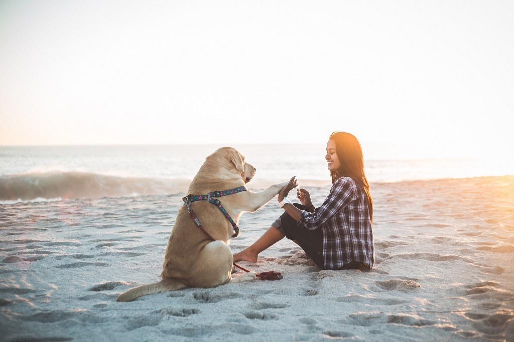

# Qwen2.5-VL-3B

## Input

- Image

  

  (Image from https://qianwen-res.oss-cn-beijing.aliyuncs.com/Qwen-VL/assets/demo.jpeg)

- Prompt

  Describe this image.

## Output

The image depicts a serene beach scene with a person and a dog sitting on the sand. The person is wearing a plaid shirt and black pants, while the dog is wearing a harness. They appear to be engaged in a playful interaction, with the dog giving the person a paw. The background shows the ocean with gentle waves, and the sky is clear with a soft light suggesting either early morning or late afternoon. The overall atmosphere is calm and peaceful.

## Usage
Automatically downloads the onnx and prototxt files on the first run.
It is necessary to be connected to the Internet while downloading.

For the sample image,
```bash
$ python3 qwen2.5_vl.py
```

If you want to specify the input image, put the image path after the `--input` option.  
```bash
$ python3 qwen2.5_vl.py --input IMAGE_PATH --prompt "Describe this image."
```

```bash
$ python3 qwen2.5_vl.py --input IMAGE_PATH IMAGE_PATH2 --prompt "Identify the similarities between these images."
```

By adding the `--video` option, you can input the video.   
```bash
$ python3 qwen2.5_vl.py --video VIDEO_PATH --prompt "Describe this video."
```

If you want to specify the prompt, put the prompt after the `--prompt` option.  
```bash
$ python3 qwen2.5_vl.py --prompt PROMPT
```

## Reference

- [Hugging Face - Qwen2.5-VL-3B-Instruct](https://huggingface.co/Qwen/Qwen2.5-VL-3B-Instruct#qwen25-vl-3b-instruct)

## Framework

Pytorch

## Model Format

ONNX opset=17

## Netron

[Qwen2.5-VL-3B_vision_encoder.onnx.prototxt](https://netron.app/?url=https://storage.googleapis.com/ailia-models/qwen2.5_vl/Qwen2.5-VL-3B_vision_encoder.onnx.prototxt)  
[Qwen2.5-VL-3B_language_model.onnx.prototxt](https://netron.app/?url=https://storage.googleapis.com/ailia-models/qwen2.5_vl/Qwen2.5-VL-3B_language_model.onnx.prototxt)  
